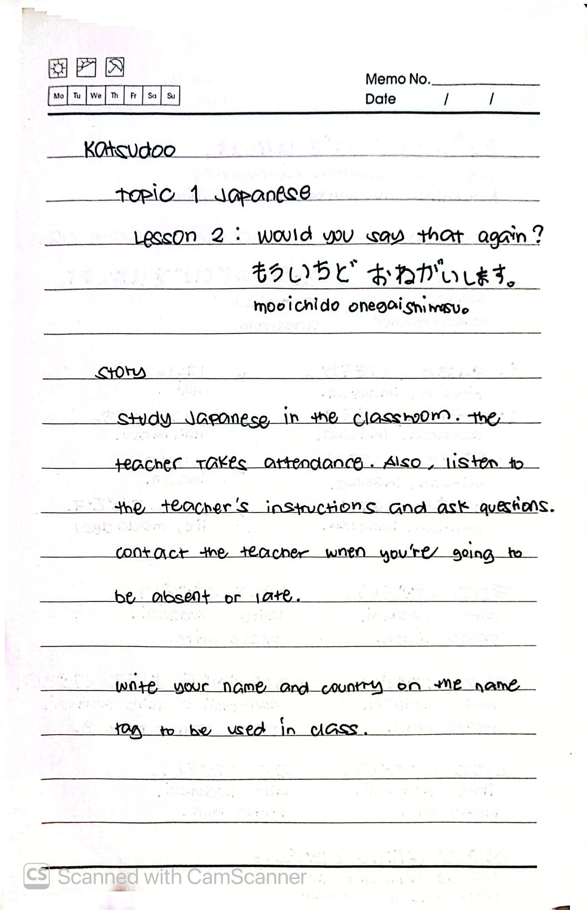
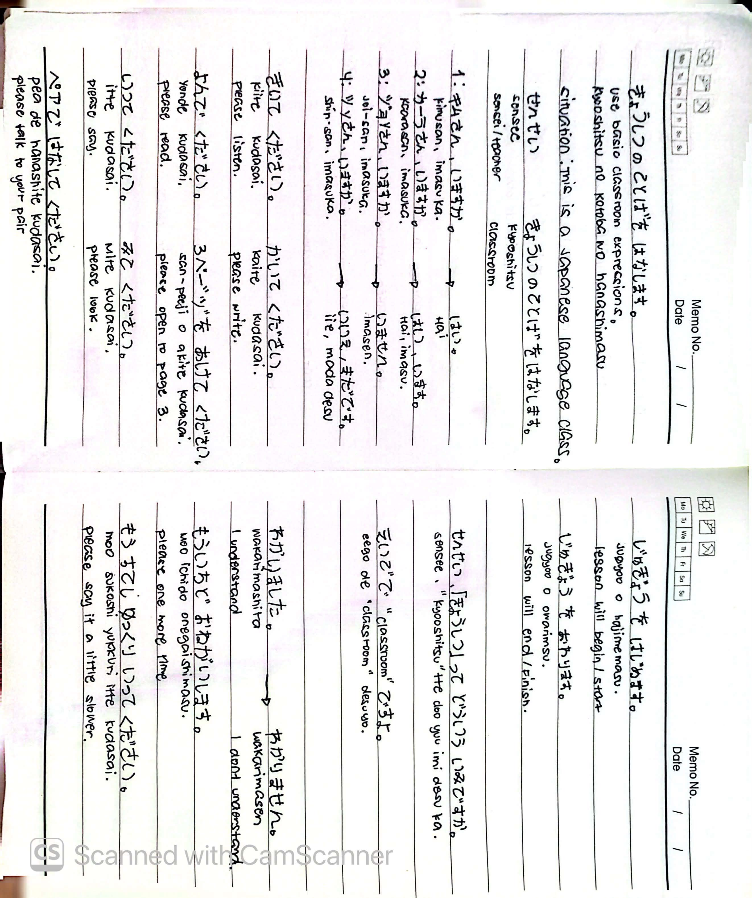
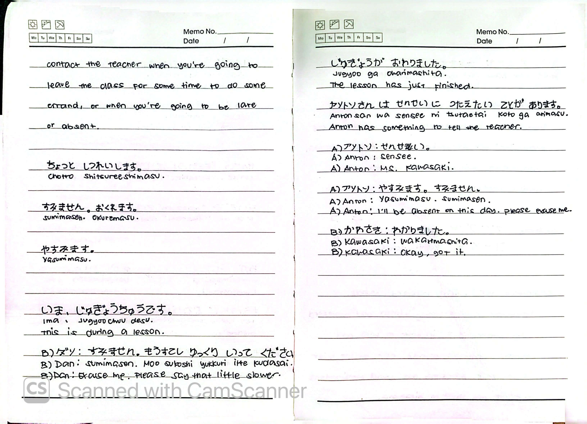
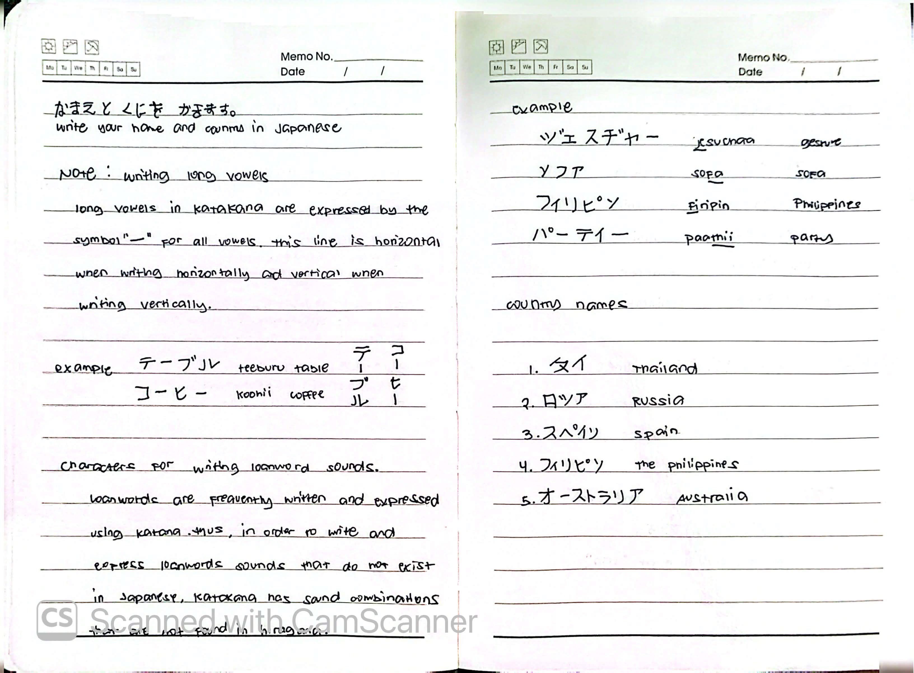
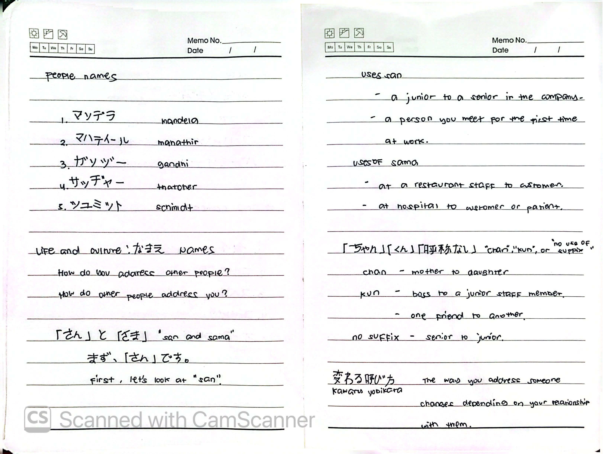

# 🎌 Lesson 2: もういちど おねがいします (Would you say that again?)

**Course:** Marugoto A1-1 (Katsudoo & Rikai)
**Topic:** Topic 1 — にほんご (Japanese)
**Mode:** かつどう (Katsudoo)
**Status:** ✅ Completed

---

## 🎯 Can-Do Objective
**Can-do 2:** Use basic classroom expressions and understand Katakana loanwords.
**Goal:** もういちど おねがいします (Mooichido onegaishimasu - Would you say that again?)

---

## 📖 Story: In the Classroom

**English Summary:**
Study Japanese in the classroom. The teacher takes attendance. Also, listen to the teacher's instructions and ask questions. Contact the teacher when you're going to be absent or late. Write your name and country on the name tag to be used in class.

**Key Vocabulary:**
*   **せんせい (Sensee):** Teacher
*   **しゅっせき (Shusseki):** Attendance
*   **しつもん (Shitsumon):** Question
*   **やすみ (Yasumi):** Absence / Rest
*   **おくれ (Okure):** Late

---

## 🗣️ Classroom Expressions

### Giving Instructions (Please do X)

| English | Romaji | Japanese |
| :--- | :--- | :--- |
| Please say it | *Itte kudasai* | いってください |
| Please read it | *Yonde kudasai* | よんでください |
| Please write it | *Kaite kudasai* | かいてください |
| Please listen | *Kiite kudasai* | きいてください |
| Please look | *Mite kudasai* | みてください |
| Please speak | *Hanashite kudasai* | はなしてください |

### Asking for Clarification

| English | Romaji | Japanese |
| :--- | :--- | :--- |
| I understand | *Wakarimashita* | わかりました |
| I don't understand | *Wakarimasen* | わかりません |
| Please say it again | *Moo ichido onegaishimasu* | もういちど おねがいします |
| Please speak a little slower | *Moo sukoshi yukkuri itte kudasai* | もうすこし ゆっくり いってください |
| Please say it a little louder | *Moo sukoshi ookii koe de itte kudasai* | もうすこし おおきい こえで いってください |
| Please open to page 3 | *San-peeji o mite kudasai* | さんぺーじを みてください |
| Please ask questions | *Shitsumon o shite kudasai* | しつもんを してください |

### Contacting the Teacher

| English | Romaji | Japanese |
| :--- | :--- | :--- |
| Excuse me for a moment | *Chotto shitsureeshimasu* | ちょっと しつれいします |
| Sorry, I'll be late | *Sumimasen. Okuremasu* | すみません。おくれます |
| I'll be absent | *Yasumimasu* | やすみます |
| I'm in class right now | *Ima, jugyoo-chuu desu* | いま、じゅぎょうちゅうです |
| The lesson has just finished | *Jugyoo ga owarimashita* | じゅぎょうが おわりました |
| I have something to tell the teacher | *Sensee ni tsutaetai koto ga arimasu* | せんせいに つたえたい ことが あります |
| I'll be absent. Please excuse me | *Yasumimasu. Sumimasen* | やすみます。すみません |
| Okay, got it | *Wakarimashita* | わかりました |

---

## 🇯🇵 Katakana & Long Vowels

In Katakana, long vowels are expressed by the symbol **ー**.
* This line is **horizontal** when writing horizontally.
* This line is **vertical** when writing vertically.

**Examples:**
* テーブル (*teeburu*) — Table
* コーヒー (*koohii*) — Coffee

### Country Names

| Japanese (Katakana) | Romaji | English |
| :--- | :--- | :--- |
| タイ | *Tai* | Thailand |
| ロシア | *Roshia* | Russia |
| スペイン | *Supein* | Spain |
| フィリピン | *Firipin* | The Philippines |
| オーストラリア | *Oosutoraria* | Australia |

### People Names

| Japanese (Katakana) | Romaji | English |
| :--- | :--- | :--- |
| マンデラ | *Mandera* | Mandela |
| マハティール | *Mahatiiru* | Mahathir |
| ガンジー | *Ganjii* | Gandhi |
| サッチャー | *Sacchaa* | Thatcher |
| シュミット | *Shumitto* | Schmidt |

**Other Loanwords:**
* ジェスチャー (*Jesuchaa*) — Gesture
* ソファ (*Sofa*) — Sofa
* パーティー (*Paatii*) — Party

---

## 👥 Addressing People (Honorifics)

How do you address other people? How do other people address you? This changes depending on your relationship.

### 「さん」(San) vs 「さま」(Sama)
* **San (さん):** Used for a junior to a senior in a company, or a person you meet for the first time at work.
* **Sama (さま):** Used by staff to customers at a restaurant, or at a hospital to a customer/patient.

### Other Suffixes
* **Chan (ちゃん):** Used by a mother to a daughter.
* **Kun (くん):** Used by a boss to a junior staff member, or one friend to another.
* **No Suffix (呼称なし):** Used by a senior to a junior.

> **変わる呼び方 (Kawaru yobikata):** The way you address someone changes depending on your relationship with them.

---

## 📝 Study Log & Additional Notes

- **2026-09-22:** Started Katsudoo Lesson 2. Learned classroom instructions and how to ask for clarification when I don't understand.
- **2026-09-23:** Continued Katsudoo Lesson 2. Learned how to contact the teacher, write long vowels in Katakana, spell country/person names, and use Japanese honorifics.
- **2026-09-24:** Completed Katsudoo Lesson 2.

---

## 📸 Handwritten Notes (Appendix)
> *Scanned pages from my physical study notebook.*

**Page 1 — Story & Classroom Rules**

**Page 2 — Classroom Expressions**

**Page 3 — Contacting the Teacher & Long Vowels**

**Page 4 — Country Names & Loanwords**

**Page 5 — Addressing People (Honorifics)**
