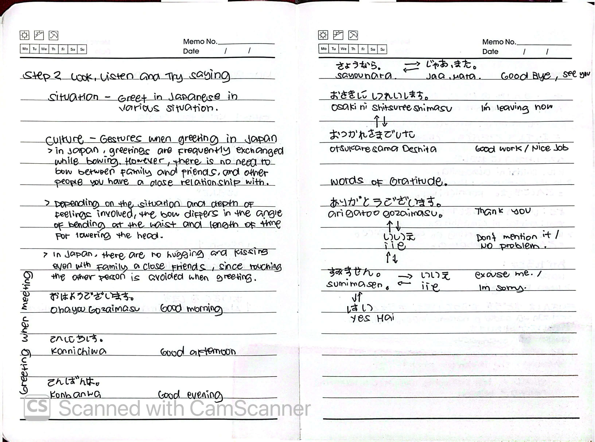
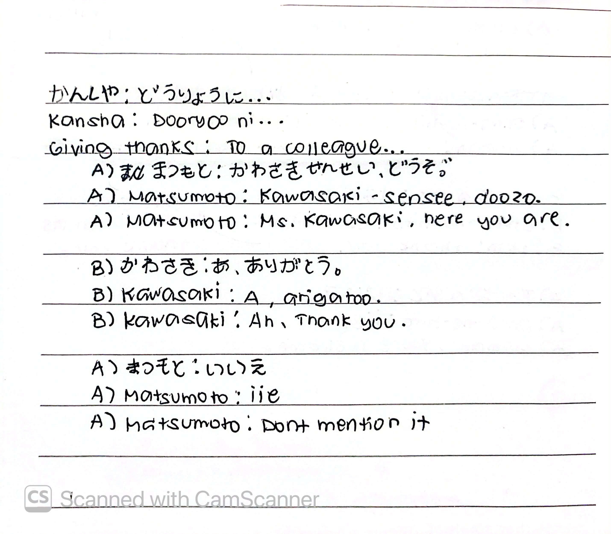
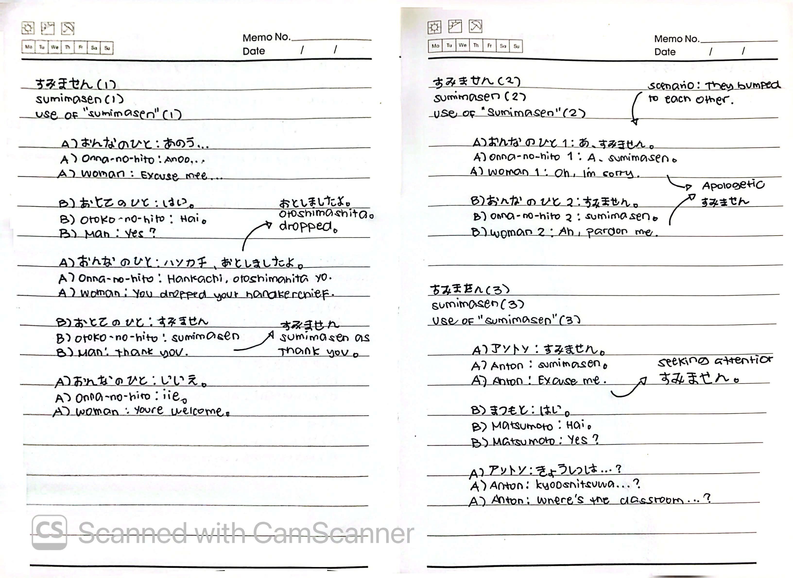

# 🎌 Lesson 1: こんにちは (Konnichiwa - Hello)

**Course:** Marugoto A1-1 (Katsudoo & Rikai)
**Topic:** Topic 1 — にほんご (Japanese)
**Mode:** かつどう (Katsudoo)
**Status:** ✅ Completed

---

## 🎯 Can-Do Objective
**Can-do 1:** Exchange greetings in Japanese in various situations.
**Goal:** あいさつを します (Exchange greetings)

---

## 📸 Handwritten Notes
> *Scanned pages from my physical study notebook.*

**Page 1 — Goals & Overview**

**Page 2 — Culture & Greetings**

**Page 3 — Practice & Reading**

**Page 4 — Giving Thanks (Kansha)**

**Page 5 — Uses of Sumimasen**

---

## ⛩️ Culture: Gestures when Greeting in Japan

- **Bowing (お辞儀 - Ojigi):** In Japan, greetings are frequently exchanged while bowing. Depending on the situation and depth of feelings involved, the bow differs in the angle of bending at the waist and length of time for lowering the head.
- **Family & Close Friends:** There is no need to bow between family, friends, and people you have a close relationship with.
- **Physical Contact:** Touching the other person is avoided when greeting—there is no hugging or kissing, even with family and close friends.

---

## 🗣️ Key Expressions & Greetings

### Time-Based Greetings

| Japanese (Kana) | Romaji | English | Context |
| :--- | :--- | :--- | :--- |
| **おはようございます** | *Ohayoo gozaimasu* | Good morning | Used in the morning |
| **こんにちは** | *Konnichiwa* | Hello / Good afternoon | Used during daytime |
| **こんばんは** | *Konbanwa* | Good evening | Used in the evening |

### Parting & Workplace Farewells (わかれるとき)

| Japanese (Kana) | Romaji | English | Context |
| :--- | :--- | :--- | :--- |
| **さようなら** | *Sayoonara* | Goodbye | Formal parting |
| **じゃあ、また** | *Jaa, mata* | See you / Bye | Casual parting |
| **おさきに しつれいします** | *Osaki ni shitsureeshimasu* | Excuse me for leaving first | Leaving work early |
| **おつかれさまでした** | *Otsukaresama deshita* | Thank you for your hard work | Workplace farewell |

### Gratitude, Apologies & Responses

| Expression | Response (Kana / Romaji) | Context |
| :--- | :--- | :--- |
| **ありがとうございます** (*Arigatoo gozaimasu*) | **いいえ** (*Iie*) | "Thank you" → "You're welcome" |
| **すみません** (*Sumimasen*) | **いいえ** (*Iie*) | "Sorry / Excuse me" → "No problem" |
| **すみません** (*Sumimasen*) | **はい** (*Hai*) | Calling for attention → "Yes?" |

---

## 💬 Practice Dialogues

### 1. Giving Thanks to a Colleague (かんしゃ - Kansha)

| Speaker | Japanese | Romaji | English |
| :--- | :--- | :--- | :--- |
| A) まつもと | かわさき せんせい、どうぞ。 | *Kawasaki-sensee, doozo.* | Ms. Kawasaki, here you are. |
| B) かわさき | あ、ありがとう。 | *A, arigatoo.* | Ah, thank you. |
| A) まつもと | いいえ。 | *Iie.* | Don't mention it. |

### 2. The 3 Uses of すみません (Sumimasen)

In Japanese, すみません is incredibly versatile. It can mean "sorry," "thank you," or "excuse me" depending on the situation.

**Situation A: Apologetic (Bumping into someone)**
| Speaker | Japanese | Romaji | English |
| :--- | :--- | :--- | :--- |
| Woman 1 | あ、すみません。 | *A, sumimasen.* | Oh, I'm sorry. |
| Woman 2 | すみません。 | *Sumimasen.* | Ah, pardon me. |

**Situation B: Gratitude (Someone helps you)**
| Speaker | Japanese | Romaji | English |
| :--- | :--- | :--- | :--- |
| Woman | あのう... | *Anoo...* | Excuse me... |
| Man | はい。 | *Hai.* | Yes? |
| Woman | ハンカチ、おとしましたよ。 | *Hankachi, otoshimashita yo.* | You dropped your handkerchief. |
| Man | すみません。 | *Sumimasen.* | Thank you. *(Here it means thank you)* |
| Woman | いいえ。 | *Iie.* | You're welcome. |

**Situation C: Seeking Attention (Asking a question)**
| Speaker | Japanese | Romaji | English |
| :--- | :--- | :--- | :--- |
| Anton | すみません。 | *Sumimasen.* | Excuse me. |
| Matsumoto | はい。 | *Hai.* | Yes? |
| Anton | きょうしつは...? | *Kyooshitsu wa...?* | Where's the classroom...? |

---

## 📖 Reading & Additional Vocabulary

**Sentence:** もりさんは さどうを ならっています。もうすぐ おけいこが おわります。
**Romaji:** *Mori-san wa sadoo o naratte imasu. Moosugu okeiko ga owarimasu.*
**Translation:** Ms. Mori is learning the art of the tea ceremony. The lesson will finish shortly.

**Vocabulary Breakdown:**
- **さどう (Sadoo):** Tea ceremony
- **ならっています (Naratte imasu):** Learning / Is learning
- **おけいこ (Okeiko):** Lesson / Practice

---

## 📝 Study Log & Additional Notes

- **2026-09-16:** Started Lesson 1. Learned basic time-based greetings and cultural bowing etiquette.
- **2026-09-19:** Learned how to give thanks to colleagues (Kansha) and mastered the three distinct uses of すみません (Sumimasen) through practice dialogues. Lesson 1 complete!