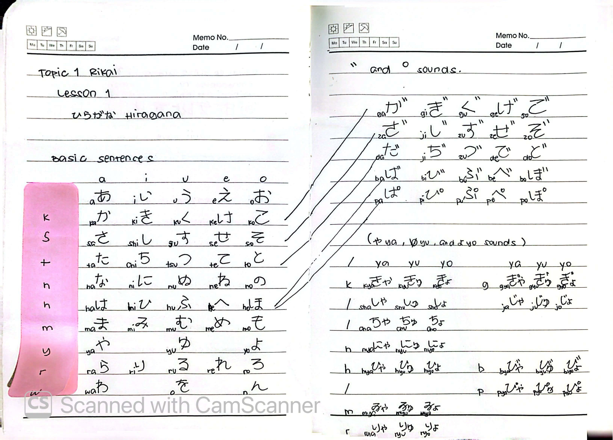
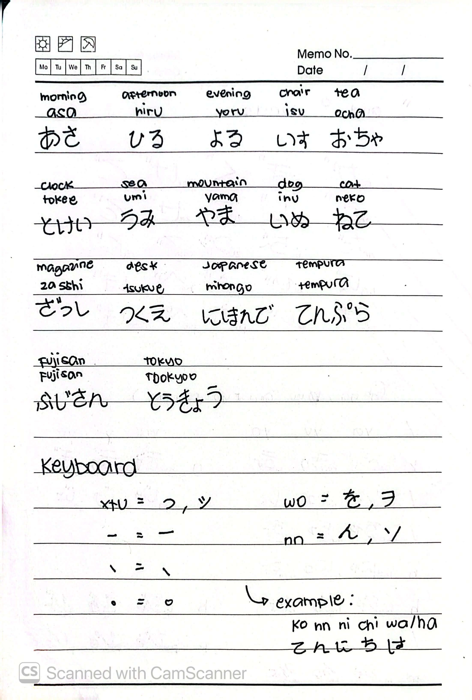

# 🎌 Rikai Lesson 1: ひらがな (Hiragana)

**Course:** Marugoto A1-1 (Katsudoo & Rikai)
**Topic:** Topic 1 — にほんご (Japanese)
**Mode:** りかい (Rikai)
**Status:** ✅ Completed

---

## 🎯 Can-Do Objective
**Can-do:** Recognize Japanese characters (にほんごを よみます - Nihongo o yomimasu).

---

## 🔤 Hiragana Chart

### Basic Sounds (Gojuuon)
| | a | i | u | e | o |
| :--- | :--- | :--- | :--- | :--- | :--- |
| **k** | あ | い | う | え | お |
| **s** | か | き | く | け | こ |
| **t** | さ | し | す | せ | そ |
| **n** | た | ち | つ | て | と |
| **h** | な | に | ぬ | ね | の |
| **m** | は | ひ | ふ | へ | ほ |
| **y** | ま | み | む | め | も |
| **r** | や | ゆ | よ | | |
| **w** | ら | り | る | れ | ろ |
| **n** | わ | | | | を |
| | | | | | ん |

### Dakuon (Voiced Sounds) & Handakuon (Semi-Voiced Sounds)
* **Dakuon:** が ぎ ぐ げ ご / ざ じ ず ぜ ぞ / だ ぢ づ で ど / ば び ぶ べ ぼ
* **Handakuon:** ぱ ぴ ぷ ぺ ぽ

### Youon (Contracted Sounds)
* **k:** きゃ きゅ きょ (kya kyu kyo)
* **s:** しゃ しゅ しょ (sha shu sho)
* **t:** ちゃ ちゅ ちょ (cha chu cho)
* **n:** にゃ にゅ にょ (nya nyu nyo)
* **h:** ひゃ ひゅ ひょ (hya hyu hyo)
* **b:** びゃ びゅ びょ (bya byu byo)
* **p:** ぴゃ ぴゅ ぴょ (pya pyu pyo)
* **m:** みゃ みゅ みょ (mya myu myo)
* **r:** りゃ りゅ りょ (rya ryu ryo)

---

## 📖 Vocabulary Practice

| English | Romaji | Hiragana |
| :--- | :--- | :--- |
| Morning | *asa* | あさ |
| Afternoon | *hiru* | ひる |
| Evening | *yoru* | よる |
| Chair | *isu* | いす |
| Tea | *ocha* | おちゃ |
| Clock | *tokee* | とけい |
| Sea | *umi* | うみ |
| Mountain | *yama* | やま |
| Dog | *inu* | いぬ |
| Cat | *neko* | ねこ |
| Magazine | *zasshi* | ざっし |
| Desk | *tsukue* | つくえ |
| Japanese | *nihongo* | にほんご |
| Tempura | *tenpura* | てんぷら |
| Mt. Fuji | *Fujisan* | ふじさん |
| Tokyo | *Tookyoo* | とうきょう |

### Keyboard Shortcuts (Typing in Japanese)
* `xtu` = っ (Small tsu)
* `-` = ー (Long vowel mark)
* `\` = 、 (Comma)
* `.` = 。 (Period)
* `wo` = を
* `nn` = ん
* *Example:* `konnichiwa` → こんにちは

---

## 📝 Study Log & Additional Notes

- **2026-09-20:** Started Rikai Lesson 1. Began studying the Hiragana chart, including basic sounds, dakuon, handakuon, and youon.
- **2026-09-22:** Completed Rikai Lesson 1. Practiced vocabulary reading and learned Japanese keyboard shortcuts.

---

## 📸 Handwritten Notes (Appendix)
> *Scanned pages from my physical study notebook.*

**Page 1 — Hiragana Chart & Basic Sentences**

**Page 2 — Vocabulary & Keyboard Shortcuts**
