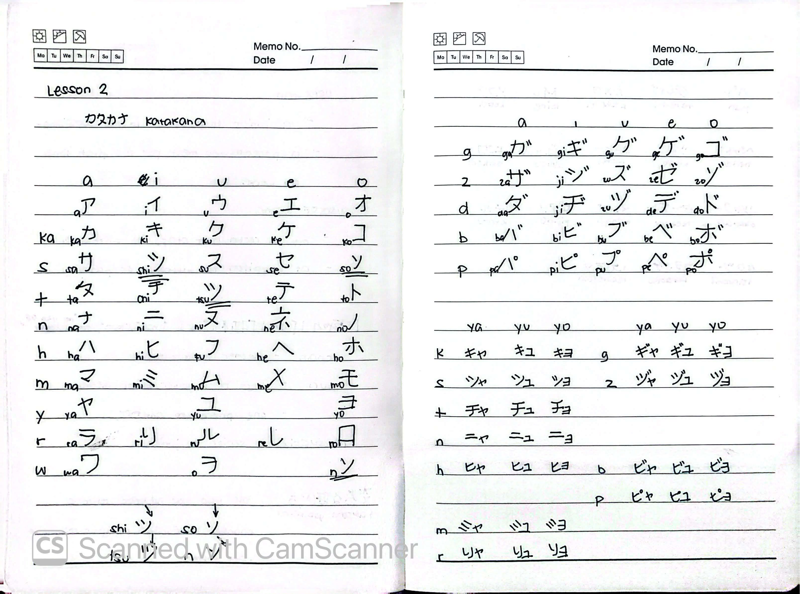

# 🎌 Rikai Lesson 2: カタカナ (Katakana)

**Course:** Marugoto A1-1 (Katsudoo & Rikai)
**Topic:** Topic 1 — にほんご (Japanese)
**Mode:** りかい (Rikai)
**Status:** 🚧 In Progress

---

## 🎯 Can-Do Objective
**Can-do:** Read and write Katakana.
**Goal:** Recognize and write foreign loanwords, names, and places.

---

## 🔤 Katakana Chart

### Basic Sounds (Gojuuon)
| | a | i | u | e | o |
| :--- | :--- | :--- | :--- | :--- | :--- |
| **k** | ア | イ | ウ | エ | オ |
| **s** | カ | キ | ク | ケ | コ |
| **t** | サ | シ | ス | セ | ソ |
| **n** | タ | チ | ツ | テ | ト |
| **h** | ナ | ニ | ヌ | ネ | ノ |
| **m** | ハ | ヒ | フ | ヘ | ホ |
| **y** | マ | ミ | ム | メ | モ |
| **r** | ヤ | ユ | ヨ | | |
| **w** | ラ | リ | ル | レ | ロ |
| **n** | ワ | | | | ヲ |
| | | | | | ン |

### Dakuon (Voiced Sounds) & Handakuon (Semi-Voiced Sounds)
* **Dakuon (g, z, d, b):** ガ ギ グ ゲ ゴ / ザ ジ ズ ゼ ゾ / ダ ヂ ヅ デ ド / バ ビ ブ ベ ボ
* **Handakuon (p):** パ ピ プ ペ ポ

### Youon (Contracted Sounds)
* **k:** キャ キュ キョ (kya kyu kyo)
* **s:** シャ シュ ショ (sha shu sho)
* **t:** チャ チュ チョ (cha chu cho)
* **n:** ニャ ニュ ニョ (nya nyu nyo)
* **h:** ヒャ ヒュ ヒョ (hya hyu hyo)
* **b:** ビャ ビュ ビョ (bya byu byo)
* **p:** ピャ ピュ ピョ (pya pyu pyo)
* **m:** ミャ ミュ ミョ (mya myu myo)
* **r:** リャ リュ リョ (rya ryu ryo)

---

## ✍️ Stroke Order & Character Differences

Pay close attention to the differences between similar-looking Katakana characters:

* **シ (shi) vs ツ (tsu):** 
  * シ (shi) has the two small strokes pointing more horizontally/upwards.
  * ツ (tsu) has the two small strokes pointing more vertically/downwards.
* **ソ (so) vs ン (n):**
  * ソ (so) has a single, longer stroke starting from the top-left and sweeping down-right.
  * ン (n) has a shorter stroke starting from the top-left and sweeping up-right.

---

## 📝 Study Log & Additional Notes

- **2026-09-24:** Started Rikai Lesson 2. Began learning the Katakana chart, including basic sounds, dakuon, handakuon, and youon. Noted the stroke order differences between シ/ツ and ソ/ン.

---

## 📸 Handwritten Notes (Appendix)
> *Scanned pages from my physical study notebook.*

**Page 1 — Katakana Charts & Stroke Order**
