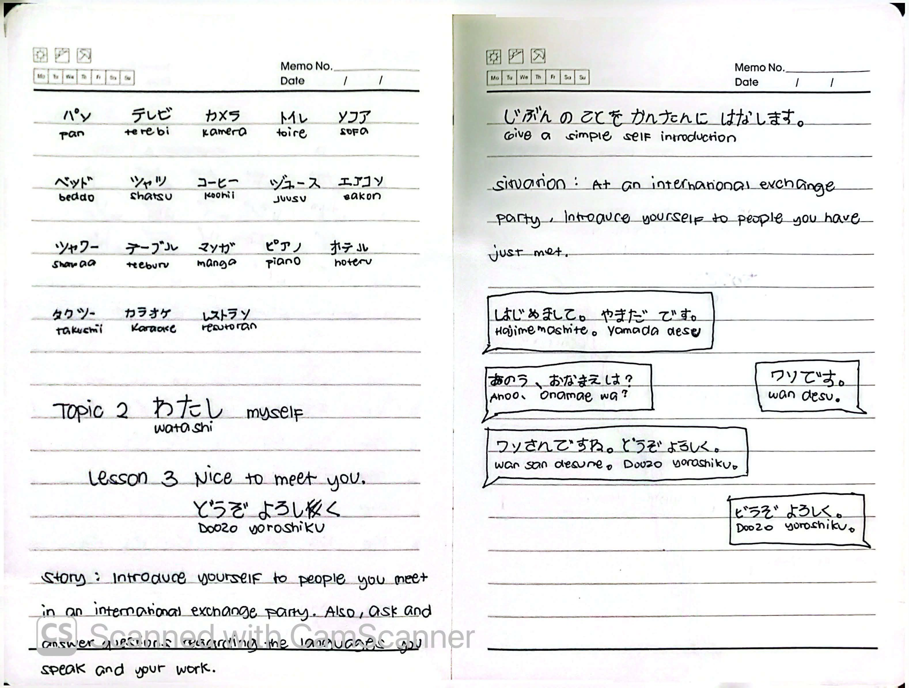
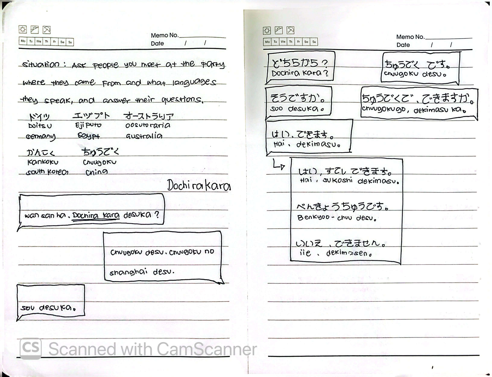
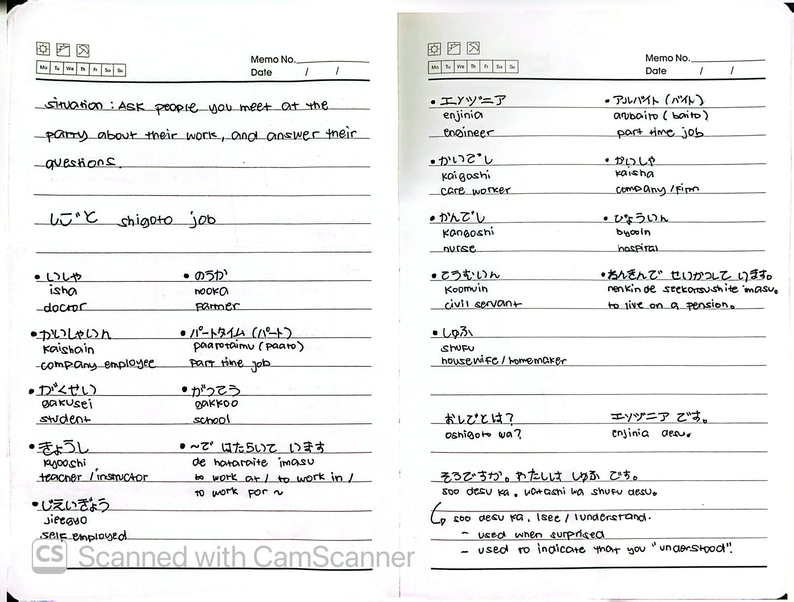

# 🎌 Lesson 3: どうぞ よろしく (Doozo yoroshiku - Nice to meet you)

**Course:** Marugoto A1-1 (Katsudoo & Rikai)
**Topic:** Topic 2 — わたし (Watashi - Myself)
**Mode:** かつどう (Katsudoo)
**Status:** 🚧 In Progress

---

## 🎯 Can-Do Objective
**Can-do 3:** Give a simple self-introduction.
**Goal:** じぶんの ことを かんたんに はなします (Give a simple self-introduction)

---

## 📖 Story: At an International Exchange Party

**English Summary:**
At an international exchange party, introduce yourself to people you have just met. Also, ask and answer questions regarding the language you speak and your work.

---

## 🗣️ Key Expressions & Dialogues

### 1. Self-Introduction

| Speaker | Japanese | Romaji | English |
| :--- | :--- | :--- | :--- |
| A | はじめまして。やまだ です。 | *Hajimemashite. Yamada desu.* | Nice to meet you. I'm Yamada. |
| B | あのう、おなまえは？ | *Anoo, onamae wa?* | Um, what is your name? |
| A | ワン です。 | *Wan desu.* | I'm Wan. |
| B | ワンさんですね。どうぞ よろしく。 | *Wan-san desu ne. Doozo yoroshiku.* | Ms. Wan, nice to meet you. |
| A | こちらこそ よろしく。 | *Kochira koso yoroshiku.* | Nice to meet you too. |

### 2. Asking About Origin & Languages

| Speaker | Japanese | Romaji | English |
| :--- | :--- | :--- | :--- |
| A | ワンさんは どちらから ですか？ | *Wan-san wa dochira kara desu ka?* | Where are you from, Ms. Wan? |
| B | 中国です。中国の 上海です。 | *Chuugoku desu. Chuugoku no Shanhai desu.* | I'm from China. Shanghai, China. |
| A | そうですか。 | *Soo desu ka.* | I see. |
| A | 中国語 できますか。 | *Chuugoku-go dekimasu ka.* | Can you speak Chinese? |
| B | はい、できます。 | *Hai, dekimasu.* | Yes, I can. |
| B | はい、すこし できます。 | *Hai, sukoshi dekimasu.* | Yes, I can speak a little. |
| B | べんきょうちゅうです。 | *Benkyoo-chuu desu.* | I'm currently studying it. |
| B | いいえ、できません。 | *Iie, dekimasen.* | No, I can't. |

### 3. Asking About Work

| Speaker | Japanese | Romaji | English |
| :--- | :--- | :--- | :--- |
| A | おしごとは？ | *Oshigoto wa?* | What is your job? |
| B | エンジニア です。 | *Enjinia desu.* | I'm an engineer. |
| A | そうですか。わたしは しゅふ です。 | *Soo desu ka. Watashi wa shufu desu.* | I see. I'm a housewife. |

> **そうですか (Soo desu ka):** Used when surprised, or used to indicate that you "understood."

---

## 🇯🇵 Vocabulary

### Common Katakana Words
| Japanese | Romaji | English |
| :--- | :--- | :--- |
| パン | *pan* | Bread |
| テレビ | *terebi* | TV |
| カメラ | *kamera* | Camera |
| トイレ | *toire* | Toilet |
| ソファ | *sofa* | Sofa |
| ベッド | *beddo* | Bed |
| シャツ | *shatsu* | Shirt |
| コーヒー | *koohii* | Coffee |
| ジュース | *juusu* | Juice |
| エアコン | *eakon* | Air conditioner |
| シャワー | *shawaa* | Shower |
| テーブル | *teeburu* | Table |
| マンガ | *manga* | Manga |
| ピアノ | *piano* | Piano |
| ホテル | *hoteru* | Hotel |
| タクシー | *takushii* | Taxi |
| カラオケ | *karaoke* | Karaoke |
| レストラン | *resutoran* | Restaurant |

### Countries
| Japanese | Romaji | English |
| :--- | :--- | :--- |
| ドイツ | *Doitsu* | Germany |
| エジプト | *Ejiputo* | Egypt |
| オーストラリア | *Oosutoraria* | Australia |
| 韓国 | *Kankoku* | South Korea |
| 中国 | *Chuugoku* | China |

### Jobs & Occupations
| Japanese | Romaji | English |
| :--- | :--- | :--- |
| しごと | *shigoto* | Job |
| いしゃ | *isha* | Doctor |
| のうか | *nooka* | Farmer |
| かいしゃいん | *kaishain* | Company employee |
| パートタイム (パート) | *paatotaimu (paato)* | Part-time job |
| がくせい | *gakusei* | Student |
| がっこう | *gakkoo* | School |
| きょうし | *kyooshi* | Teacher / Instructor |
| じえいぎょう | *jieegyo* | Self-employed |
| エンジニア | *enjinia* | Engineer |
| アルバイト | *arubaito* | Part-time job |
| かいごし | *kaigoshi* | Care worker |
| かいしゃ | *kaisha* | Company / Firm |
| かんごし | *kangoshi* | Nurse |
| びょういん | *byooin* | Hospital |
| こうむいん | *koomuin* | Civil servant |
| ねんきん で せいかつしています | *nenkin de seikatsu shite imasu* | To live on a pension |
| しゅふ | *shufu* | Housewife / Homemaker |

---

## 📝 Study Log & Additional Notes

- **2026-09-26:** Started Topic 2 (Katsudoo Lesson 3). Learned how to introduce myself, ask where people are from, ask what languages they speak, and ask about their jobs.

---

## 📸 Handwritten Notes (Appendix)
> *Scanned pages from my physical study notebook.*

**Page 1 — Katakana Vocab & Self-Introduction**

**Page 2 — Countries & Languages**

**Page 3 — Jobs & Occupations**
