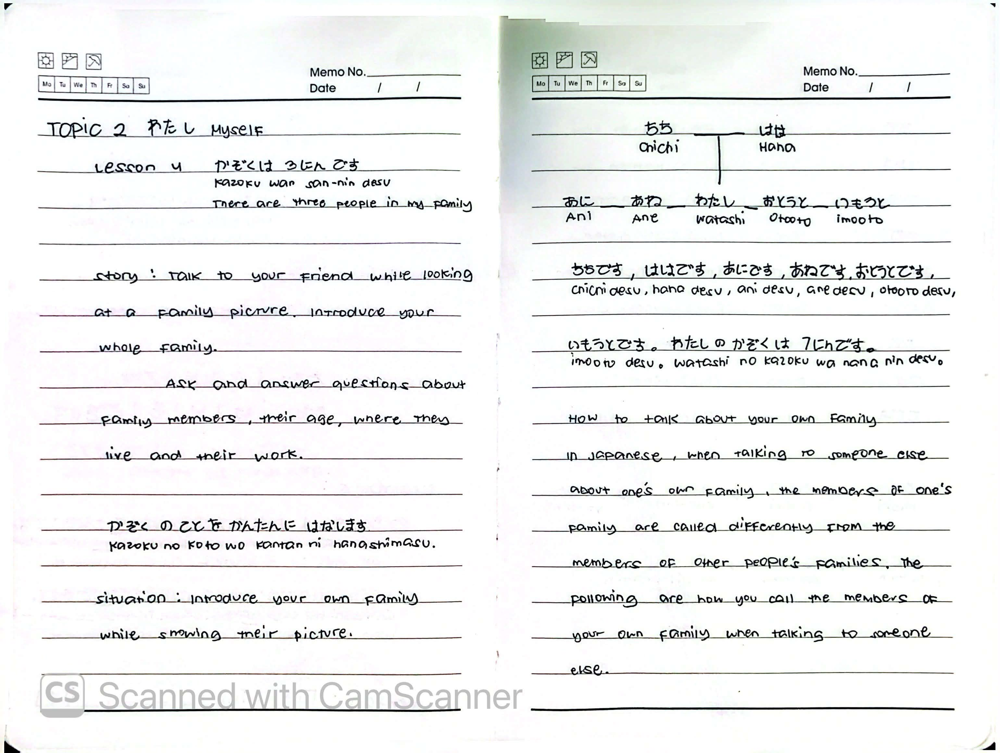
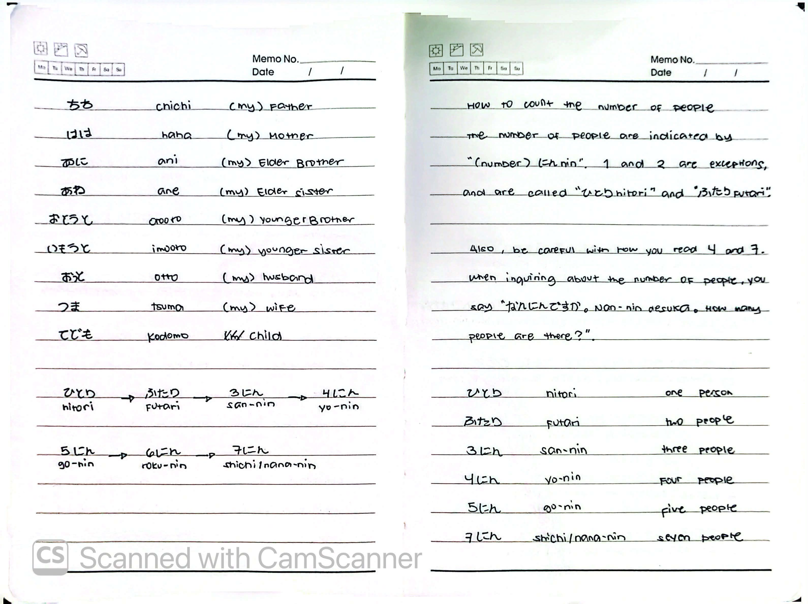
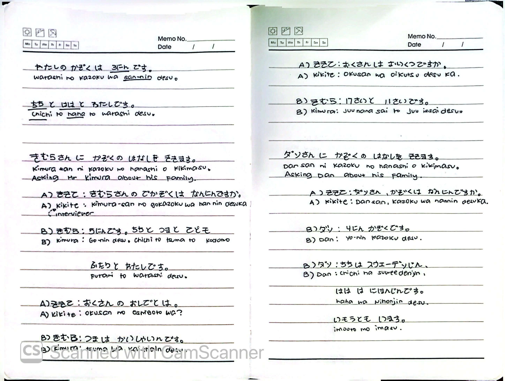
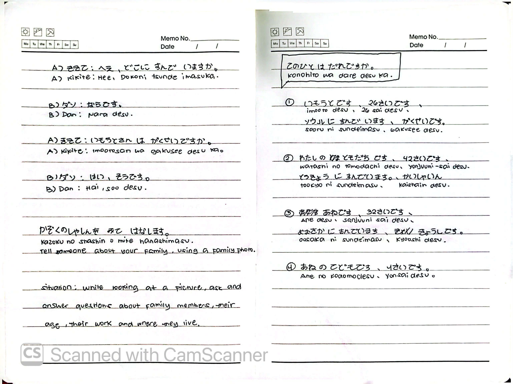
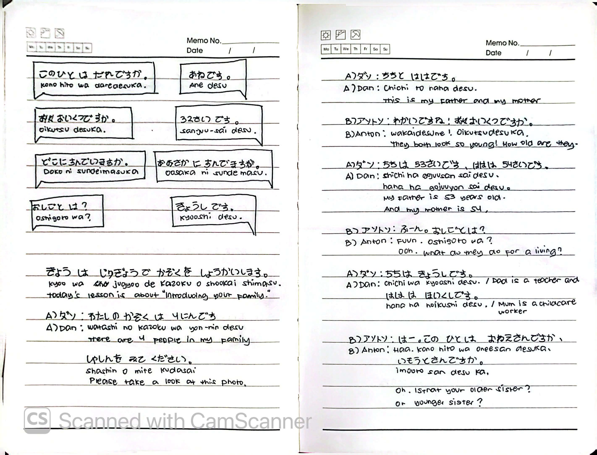
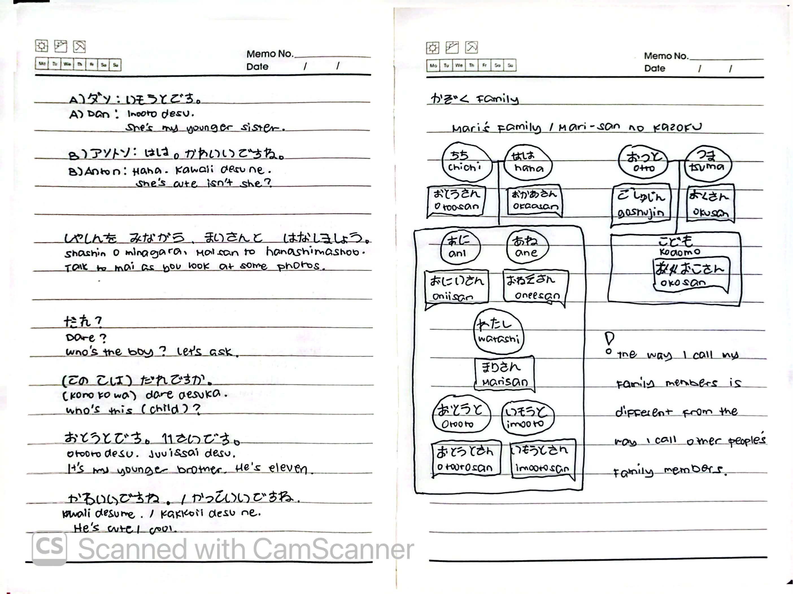

# 🎌 Lesson 4: かぞくは さんにんです (Kazoku wa san-nin desu)

**Course:** Marugoto A1-1 (Katsudoo & Rikai)
**Topic:** Topic 2 — わたし (Watashi - Myself)
**Mode:** かつどう (Katsudoo)
**Status:** 🚧 In Progress

---

## 🎯 Can-Do Objective
**Can-do 4:** Talk about your family.
**Goal:** かぞくの ことを かんたんに はなします (Talk simply about your family)

---

## 📖 Story: Family Picture

**English Summary:**
Talk to your friend while looking at a family picture. Introduce your whole family. Ask and answer questions about family members, their age, where they live, and their work.

**Key Sentence:**
* かぞくの ことを かんたんに はなします。
* *Kazoku no koto o kantan ni hanashimasu.*
* I talk simply about my family.

---

## 👨‍👩‍👧‍👦 Family Vocabulary

### My Own Family vs. Someone Else's Family
In Japanese, when talking to someone else about **your own family**, you use different words than when talking about **someone else's family**.

| Relationship | My Own Family | Someone Else's Family |
| :--- | :--- | :--- |
| Father | ちち (*chichi*) | おとうさん (*otousan*) |
| Mother | はは (*haha*) | おかあさん (*okaasan*) |
| Husband | おっと (*otto*) | ごしゅじん (*goshujin*) |
| Wife | つま (*tsuma*) | おくさん (*okusan*) |
| Elder Brother | あに (*ani*) | おにいさん (*oniisan*) |
| Elder Sister | あね (*ane*) | おねえさん (*oneesan*) |
| Younger Brother | おとうと (*otooto*) | おとうとさん (*otootosan*) |
| Younger Sister | いもうと (*imooto*) | いもうとさん (*imootosan*) |
| Child | こども (*kodomo*) | おこさん (*okosan*) |

> **Note:** The way I call my family members is different from the way I call other people's family members.

### Family Tree (Mari's Family)
ちち (chichi) ─── はは (haha)
[Otousan] [Okaasan]
│
┌─────────┴─────────┐
おっと (otto) つま (tsuma)
[Goshujin] [Okusan]
│ │
あに (ani) あね (ane)
[Oniisan] [Oneesan]
│
わたし (watashi)
[Watashi]
│
おとうと (otooto) いもうと (imooto)
[Otootosan] [Imootosan]
│
こども (kodomo)
[Okosan]

---

## 🔢 Counting People

The number of people is indicated by **"(number) にん (nin)"**.
**1 and 2 are exceptions** and are called **ひとり (hitori)** and **ふたり (futari)**.

| Number | Japanese | Romaji |
| :---: | :--- | :--- |
| 1 | ひとり | *hitori* |
| 2 | ふたり | *futari* |
| 3 | さんにん | *san-nin* |
| 4 | よにん | *yo-nin* |
| 5 | ごにん | *go-nin* |
| 6 | ろくにん | *roku-nin* |
| 7 | しちにん / ななにん | *shichi-nin / nana-nin* |

> **Note:** Be careful with how you read 4 (よん) and 7 (しち/なな).

**Asking about the number of people:**
* なんにんですか。 (*Nan-nin desu ka.*) — How many people are there?

---

## 🗣️ Asking About Family Members

### Key Questions

| English | Romaji | Japanese |
| :--- | :--- | :--- |
| Who is this person? | *Kono hito wa dare desu ka.* | このひとは だれですか。 |
| How old is he/she? | *Oikutsu desu ka.* | おいくつですか。 |
| Where does he/she live? | *Doko ni sunde imasu ka.* | どこに すんでいますか。 |
| What is his/her job? | *Oshigoto wa?* | おしごとは？ |

### Answer Patterns

| English | Romaji | Japanese |
| :--- | :--- | :--- |
| He/She is my older sister. | *Ane desu.* | あねです。 |
| He/She is 32 years old. | *Sanjuu-ni-sai desu.* | 32さいです。 |
| He/She lives in Osaka. | *Oosaka ni sunde imasu.* | おおさかに すんでいます。 |
| He/She is a teacher. | *Kyooshi desu.* | きょうしです。 |

---

## 💬 Example Sentences & Dialogues

### Basic Sentences
| Japanese | Romaji | English |
| :--- | :--- | :--- |
| わたしの かぞくは よにんです。 | *Watashi no kazoku wa yo-nin desu.* | There are 4 people in my family. |
| しゃしんを みて ください。 | *Shashin o mite kudasai.* | Please take a look at this photo. |
| ちちと ははです。 | *Chichi to haha desu.* | This is my father and my mother. |

### Dialogue 1: Interviewing Mr. Kimura

| Speaker | Japanese | Romaji | English |
| :--- | :--- | :--- | :--- |
| ききて | きむらさんの ごかぞくは なんにんですか。 | *Kimura-san no gokazoku wa nan-nin desu ka.* | Mr. Kimura, how many people are in your family? |
| きむら | ごにんです。ちちと つま と こども ふたりと わたしです。 | *Go-nin desu. Chichi to tsuma to kodomo futari to watashi desu.* | Five people. My father, my wife, two children, and me. |
| ききて | おくさんの おしごとは。 | *Okusan no oshigoto wa?* | What is your wife's job? |
| きむら | つまは かいしゃいんです。 | *Tsuma wa kaishain desu.* | My wife is an office worker. |

### Dialogue 2: Interviewing Dan

| Speaker | Japanese | Romaji | English |
| :--- | :--- | :--- | :--- |
| ききて | ダンさん、かぞくは なんにんですか。 | *Dan-san, kazoku wa nan-nin desu ka.* | Dan, how many people are in your family? |
| ダン | よにん かぞくです。 | *Yo-nin kazoku desu.* | A family of four. |
| ダン | ちちは スウェーデンじん、ははは にほんじんです。いもうとも います。 | *Chichi wa Suweeden-jin, haha wa Nihonjin desu. Imooto mo imasu.* | My father is Swedish, my mother is Japanese. I also have a younger sister. |

### Dialogue 3: Asking About Age & Work

| Speaker | Japanese | Romaji | English |
| :--- | :--- | :--- | :--- |
| ダン | わたしの かぞくは よにんです。しゃしんを みて ください。 | *Watashi no kazoku wa yo-nin desu. Shashin o mite kudasai.* | There are 4 people in my family. Please take a look at this photo. |
| アントン | わかいですね！おいくつですか。 | *Wakai desu ne! Oikutsu desu ka.* | They look so young! How old are they? |
| ダン | ちちは 53さいです。ははは 54さいです。 | *Chichi wa gojuusan-sai desu. Haha wa gojuuyon-sai desu.* | My father is 53. And my mother is 54. |
| アントン | ふーん。おしごとは？ | *Fuun. Oshigoto wa?* | Ooh. What do they do for a living? |
| ダン | ちちは きょうしです。ははは ほいくしです。 | *Chichi wa kyooshi desu. Haha wa hoikushi desu.* | Dad is a teacher and Mum is a childcare worker. |
| アントン | はー。このひとは おねえさんですか、いもうとさんですか。 | *Haa. Kono hito wa oneesan desu ka, imootosan desu ka.* | Oh. Is that your older sister? Or younger sister? |
| ダン | いもうとです。 | *Imooto desu.* | She's my younger sister. |
| アントン | はは。かわいいですね。 | *Haha. Kawaii desu ne.* | She's cute, isn't she? |

### Dialogue 4: Talking About Photos with Mari

| Speaker | Japanese | Romaji | English |
| :--- | :--- | :--- | :--- |
| — | しゃしんを みながら、もりさんと はなしましょう。 | *Shashin o minagara, Mori-san to hanashimashoo.* | Talk to Mori as you look at some photos. |
| モリ | (このひとは) だれですか。 | *(Kono hito wa) dare desu ka.* | Who's this (child)? |
| — | おとうとです。11さいです。 | *Otooto desu. Juuissai desu.* | It's my younger brother. He's eleven. |
| モリ | かわいいですね。/ かっこいいですね。 | *Kawaii desu ne. / Kakkoii desu ne.* | He's cute! / cool. |

### Dialogue 5: Mari's Sisters

| Speaker | Japanese | Romaji | English |
| :--- | :--- | :--- | :--- |
| ダン | いもうとです。 | *Imooto desu.* | She's my younger sister. |
| アントン | はは。かわいいですね。 | *Haha. Kawaii desu ne.* | She's cute, isn't she? |

---

## 📝 Study Log & Additional Notes

- **2026-10-01:** Started Katsudoo Lesson 4. Learned family vocabulary (own family vs. others), how to count people (hitori, futari, san-nin...), and how to talk about family members and their jobs.
- **2026-10-02:** Continued Katsudoo Lesson 4. Learned how to ask about age (おいくつですか), residence (どこに すんでいますか), and jobs. Studied the difference between own-family and others'-family vocabulary, plus the full family tree with both word sets.

---

## 📸 Handwritten Notes (Appendix)
> *Scanned pages from my physical study notebook.*

**Page 1 — Intro & Family Members**

**Page 2 — Family Vocab & Counting People**

**Page 3 — Example Sentences & Dialogues**

**Page 4 — Asking About Age, Residence, and Work**

**Page 5 — Family Dialogues (Dan & Anton)**

**Page 6 — Family Tree & Own/Others' Vocabulary**
