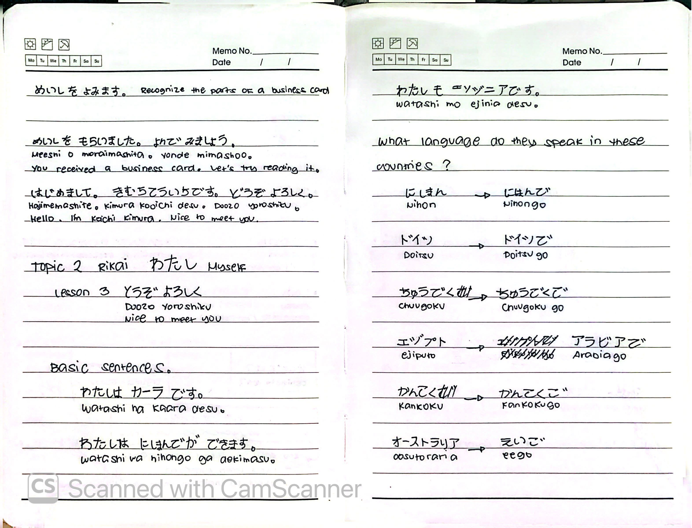
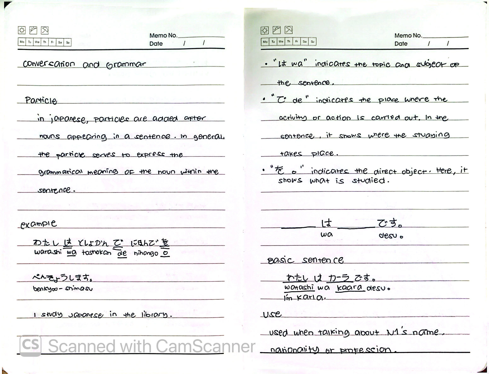
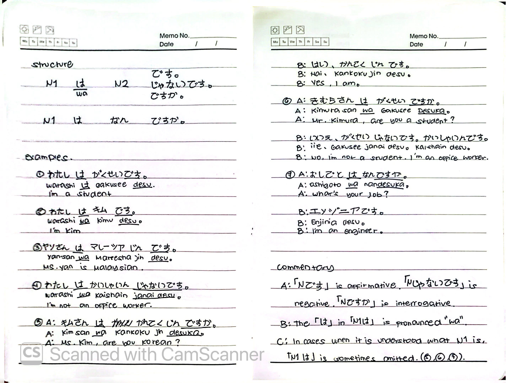

# 🎌 Rikai Lesson 3: どうぞ よろしく (Doozo yoroshiku)

**Course:** Marugoto A1-1 (Katsudoo & Rikai)
**Topic:** Topic 2 — わたし (Watashi - Myself)
**Mode:** りかい (Rikai)
**Status:** 🚧 In Progress

---

## 🎯 Can-Do Objective
**Can-do:** Recognize the parts of a business card and understand basic sentence structure.
**Goal:** めいしを よみます (Recognize the parts of a business card)

---

## 📇 Business Cards & Introductions

**Sentence:** めいしを もらいました。よんで みましょう。
**Romaji:** *Meishi o moraimashita. Yonde mimashoo.*
**Translation:** You received a business card. Let's try reading it.

**Example Introduction:**
* はじめまして。きむら こういち です。どうぞ よろしく。
* *Hajimemashite. Kimura Kooichi desu. Doozo yoroshiku.*
* Hello, I'm Koichi Kimura. Nice to meet you.

---

## 🗣️ Basic Sentences

| Japanese | Romaji | English |
| :--- | :--- | :--- |
| わたしは カーナ です。 | *Watashi wa Kaana desu.* | I'm Karna. |
| わたしは にほんごが できます。 | *Watashi wa nihongo ga dekimasu.* | I can speak Japanese. |
| わたしも エンジニアです。 | *Watashi mo enjinia desu.* | I'm also an engineer. |

---

## 🌍 Country → Language Pairs

| Country | Language |
| :--- | :--- |
| にほん (Nihon — Japan) | → にほんご (Nihongo — Japanese) |
| ドイツ (Doitsu — Germany) | → ドイツご (Doitsu-go — German) |
| ちゅうごく (Chuugoku — China) | → ちゅうごくご (Chuugoku-go — Chinese) |
| エジプト (Ejiputo — Egypt) | → アラビアご (Arabia-go — Arabic) |
| かんこく (Kankoku — Korea) | → かんこくご (Kankoku-go — Korean) |
| オーストラリア (Oosutoraria — Australia) | → えいご (Eego — English) |

---

## 🔑 Particles (助詞 - Joshi)

In Japanese, particles are added **after nouns** appearing in a sentence. In general, the particle serves to express the grammatical meaning of the noun within the sentence.

### Example Sentence
**わたしは としょかんで にほんごを べんきょうします。**
*Watashi wa toshokan de nihongo o benkyoo-shimasu.*
**I study Japanese in the library.**

### Particle Breakdown

| Particle | Pronunciation | Function |
| :---: | :---: | :--- |
| **は** | *wa* | Indicates the **topic and subject** of the sentence. |
| **で** | *de* | Indicates the **place** where the activity or action is carried out. In this sentence, it shows where the studying takes place. |
| **を** | *o* | Indicates the **direct object**. In this sentence, it shows what is studied. |

---

## 🏗️ Sentence Structure

### Core Pattern
N1 は N2 です。

### Variations

| Form | Pattern | Meaning |
| :--- | :--- | :--- |
| **Affirmative** | N1 は N2 です。 | N1 is N2. |
| **Negative** | N1 は N2 じゃないです。 | N1 is not N2. |
| **Interrogative** | N1 は N2 ですか。 | Is N1 N2? |
| **Question Word** | N1 は なん ですか。 | What is N1? |

### Examples

| # | Japanese | Romaji | English |
| :---: | :--- | :--- | :--- |
| ① | わたしは がくせいです。 | *Watashi wa gakusee desu.* | I'm a student. |
| ② | わたしは キム です。 | *Watashi wa Kimu desu.* | I'm Kim. |
| ③ | ヤンさんは マレーシアじん です。 | *Yan-san wa Mareeshia-jin desu.* | Ms. Yan is Malaysian. |
| ④ | わたしは かいしゃいん じゃないです。 | *Watashi wa kaishain ja nai desu.* | I'm not an office worker. |
| ⑤ | A: キムさんは かんこくじん ですか。 | *Kimu-san wa Kankoku-jin desu ka.* | Ms. Kim, are you Korean? |
|   | B: はい、かんこくじん です。 | *Hai, Kankoku-jin desu.* | Yes, I am. |
| ⑥ | A: キムラさんは がくせい ですか。 | *Kimura-san wa gakusee desu ka.* | Mr. Kimura, are you a student? |
|   | B: いいえ、がくせい じゃないです。かいしゃいん です。 | *Iie, gakusee ja nai desu. Kaishain desu.* | No, I'm not a student. I'm an office worker. |
| ⑦ | A: おしごとは なんですか。 | *Oshigoto wa nan desu ka.* | What's your job? |
|   | B: エンジニアです。 | *Enjinia desu.* | I'm an engineer. |

---

## 📝 Commentary & Key Notes

**A.** 「N です」is **affirmative**, 「N じゃないです」is **negative**, and 「N ですか」is **interrogative**.

**B.** The 「は」in 「N1 は」is pronounced **"wa"** (not "ha").

**C.** In cases when it is understood what N1 is, 「N1 は」is **sometimes omitted**. (See examples ⑤, ⑥, ⑦.)

---

## 📝 Study Log & Additional Notes

- **2026-09-28:** Started Rikai Lesson 3. Learned how to read business cards, country/language pairs, the three core particles (は, で, を), and basic sentence structure (N1 は N2 です).

---

## 📸 Handwritten Notes (Appendix)
> *Scanned pages from my physical study notebook.*

**Page 1 — Business Card & Language Pairs**

**Page 2 — Particles & Grammar Intro**

**Page 3 — Sentence Structure & Examples**
