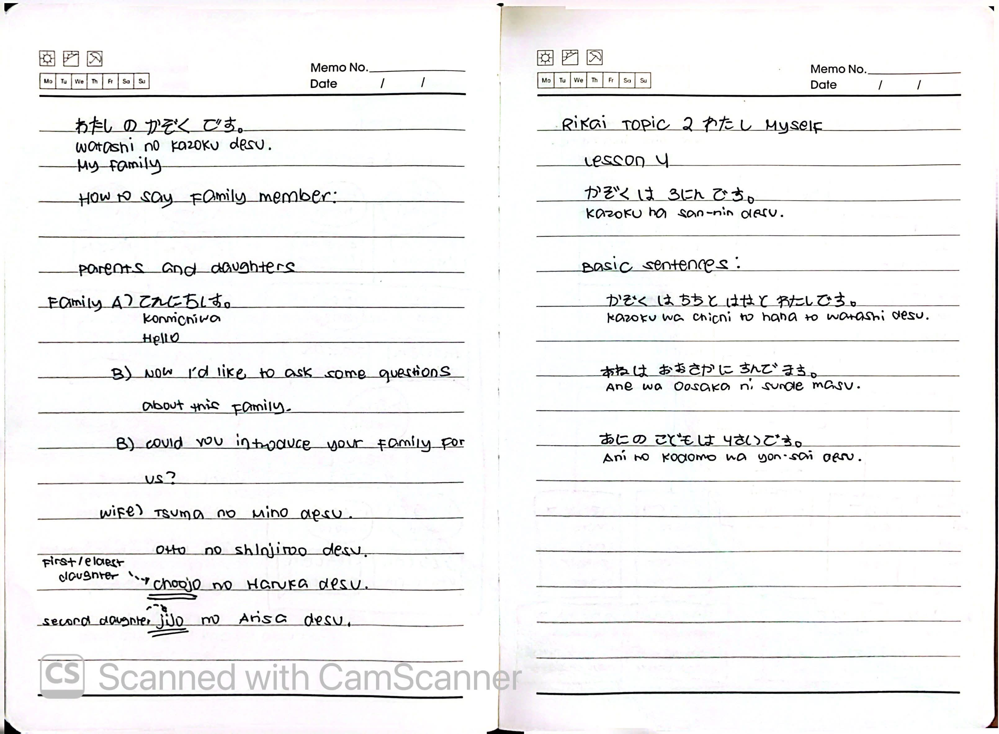
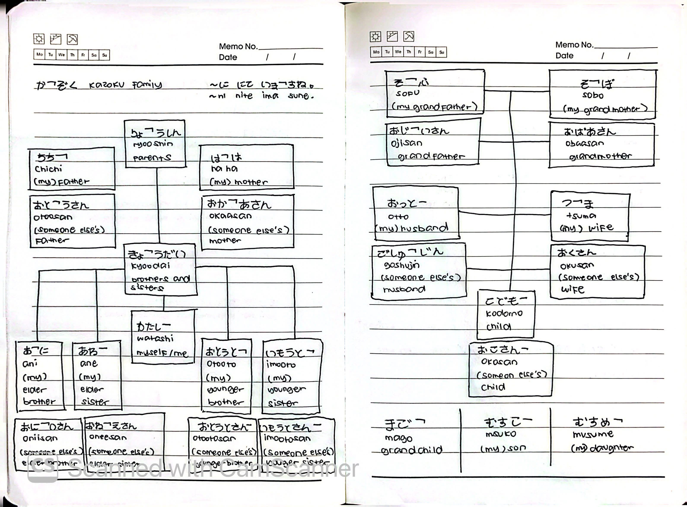
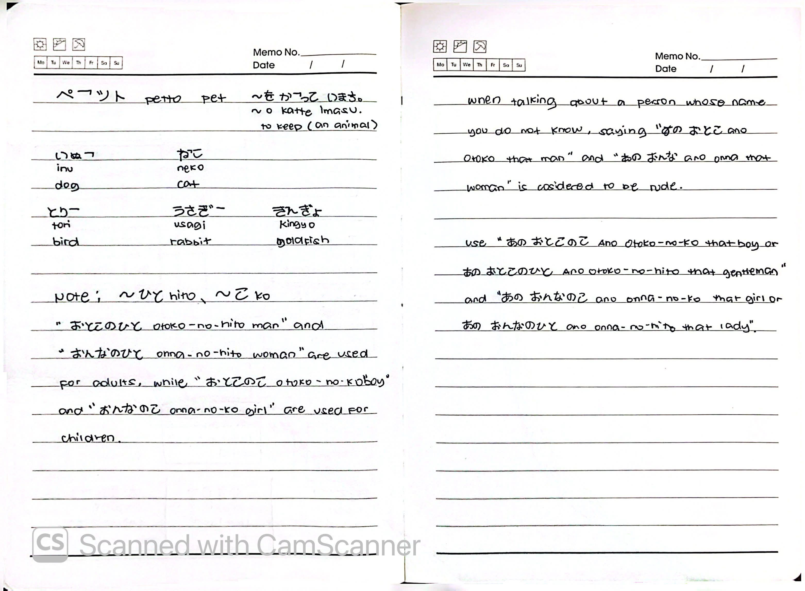
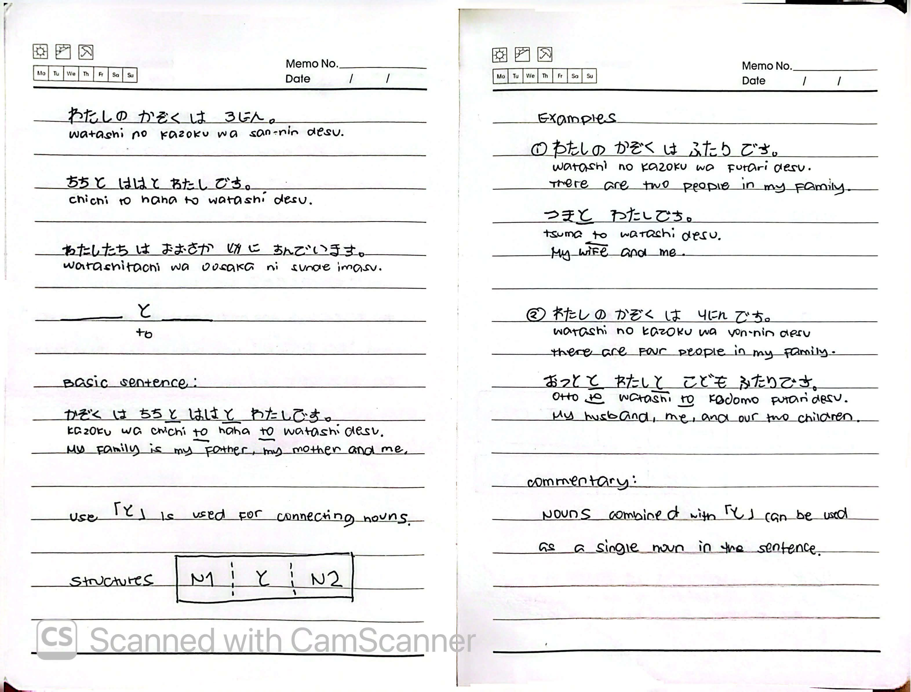
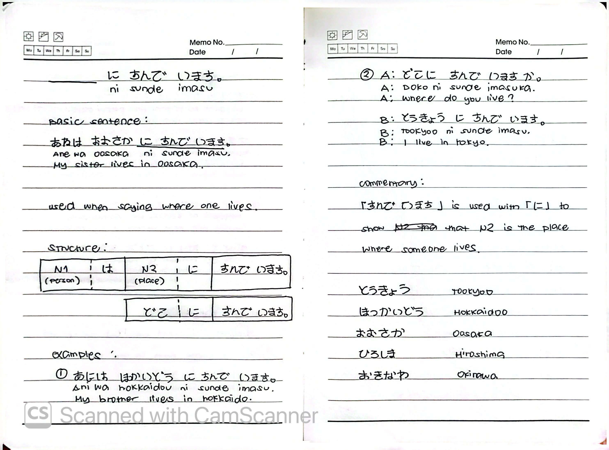
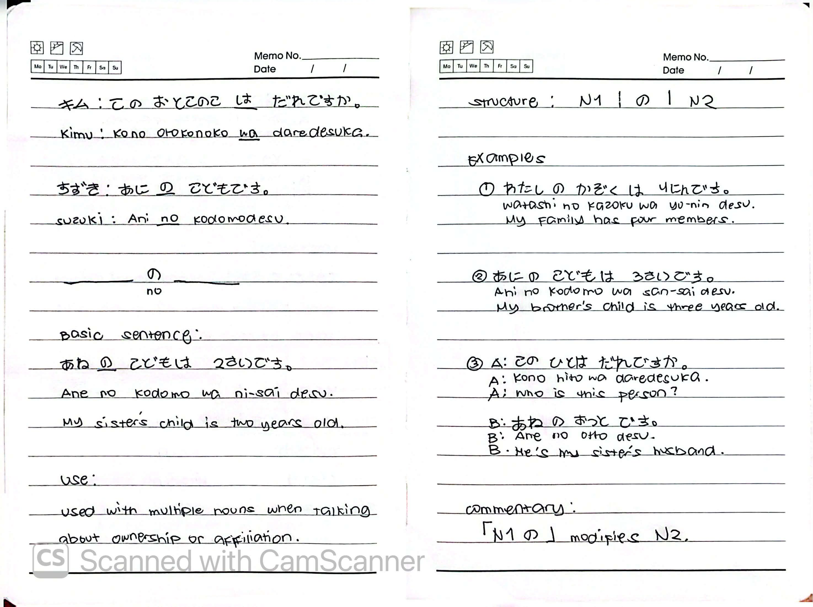
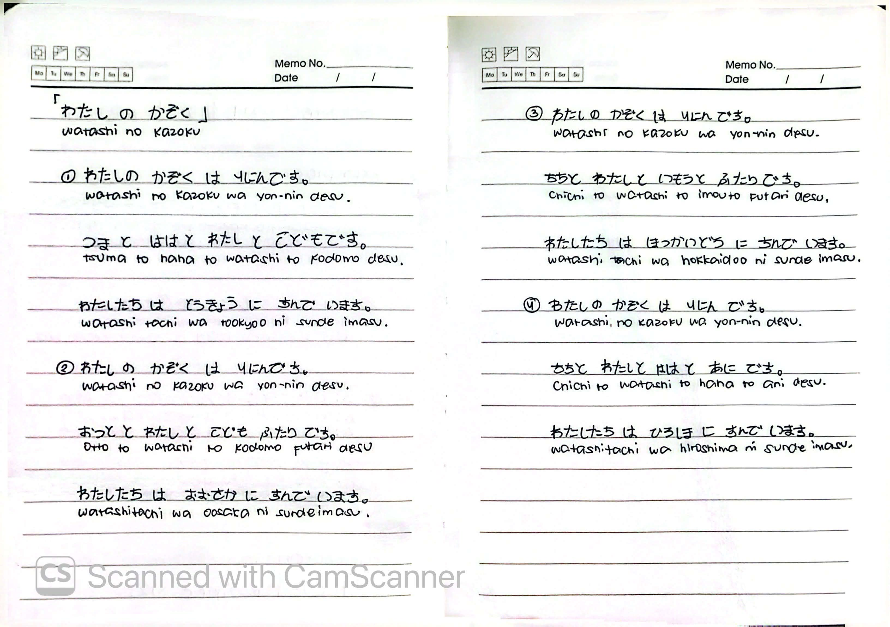

# 🎌 Rikai Lesson 4: かぞくは さんにんです (Kazoku wa san-nin desu)

**Course:** Marugoto A1-1 (Katsudoo & Rikai)
**Topic:** Topic 2 — わたし (Watashi - Myself)
**Mode:** りかい (Rikai)
**Status:** ✅ Completed

---

## 🎯 Can-Do Objective
**Can-do:** Read and write family vocabulary, count people, and use essential particles to describe family.
**Goal:** かぞくの ことを よみます (Read about family)

---

## 🗣️ Basic Sentences

| Japanese | Romaji | English |
| :--- | :--- | :--- |
| わたしの かぞくは さんにんです。 | *Watashi no kazoku wa san-nin desu.* | There are three people in my family. |
| ちちと ははと わたしです。 | *Chichi to haha to watashi desu.* | My father, my mother, and me. |
| わたしたちは おおさかに すんでいます。 | *Watashitachi wa Oosaka ni sunde imasu.* | We live in Osaka. |

---

## 👨‍👩‍👧‍👦 Complete Family Tree

### Own Family vs. Someone Else's Family

| Relationship | My Own Family | Someone Else's Family |
| :--- | :--- | :--- |
| Grandfather | そふ (*sofu*) | おじいさん (*ojiisan*) |
| Grandmother | そぼ (*sobo*) | おばあさん (*obaasan*) |
| Father | ちち (*chichi*) | おとうさん (*otousan*) |
| Mother | はは (*haha*) | おかあさん (*okaasan*) |
| Husband | おっと (*otto*) | ごしゅじん (*goshujin*) |
| Wife | つま (*tsuma*) | おくさん (*okusan*) |
| Elder Brother | あに (*ani*) | おにいさん (*oniisan*) |
| Elder Sister | あね (*ane*) | おねえさん (*oneesan*) |
| Younger Brother | おとうと (*otooto*) | おとうとさん (*otootosan*) |
| Younger Sister | いもうと (*imooto*) | いもうとさん (*imootosan*) |
| Child | こども (*kodomo*) | おこさん (*okosan*) |

### Additional Family Terms

| Japanese | Romaji | English |
| :--- | :--- | :--- |
| りょうしん | *ryooshin* | parents |
| きょうだい | *kyoodai* | brothers and sisters |
| わたし | *watashi* | myself / me |
| むすこ | *musuko* | (my) son |
| むすめ | *musume* | (my) daughter |
| まご | *mago* | grandchild |

### Family Tree Diagram
そふ (sofu) ────────── そぼ (sobo)
[Ojiisan] [Obaasan]
│
ちち (chichi) ──────── はは (haha)
[Otousan] [Okaasan]
│
┌─────────┴──────────┐
あに (ani) わたし (watashi)
[Oniisan] [Watashi]
│
こども (kodomo)
[Okosan]

─── also ───
おっと (otto) ─────── つま (tsuma)
[Goshujin] [Okusan]
│
こども (kodomo)
[Okosan]

---

## 🔗 Grammar: Connecting Nouns with と (to)

### Basic Sentence
**かぞくは ちちと ははと わたしです。**
*Kazoku wa chichi to haha to watashi desu.*
**My family is my father, my mother, and me.**

### Use
「と」is used for **connecting nouns**.

### Structure
N1 と N2

### Examples

| # | Japanese | Romaji | English |
| :---: | :--- | :--- | :--- |
| ① | わたしの かぞくは ふたりです。つまと わたしです。 | *Watashi no kazoku wa futari desu. Tsuma to watashi desu.* | There are two people in my family. My wife and me. |
| ② | わたしの かぞくは よにんです。おっとと わたしと こども ふたりです。 | *Watashi no kazoku wa yo-nin desu. Otto to watashi to kodomo futari desu.* | There are four people in my family. My husband, me, and our two children. |

### Commentary
Nouns combined with 「と」can be used as a **single noun** in the sentence.

---

## 🏠 Grammar: に すんでいます (ni sunde imasu)

### Basic Sentence
**あねは おおさかに すんでいます。**
*Ane wa Oosaka ni sunde imasu.*
**My sister lives in Osaka.**

### Use
Used when **saying where one lives**.

### Structure
N1 (person) は N2 (place) に すんでいます。
どこ に すんでいますか。

### Examples

| # | Japanese | Romaji | English |
| :---: | :--- | :--- | :--- |
| ① | あには ほっかいどうに すんでいます。 | *Ani wa Hokkaidoo ni sunde imasu.* | My brother lives in Hokkaido. |
| ② | A: どこに すんでいますか。 | *A: Doko ni sunde imasu ka.* | A: Where do you live? |
|   | B: とうきょうに すんでいます。 | *B: Tookyoo ni sunde imasu.* | B: I live in Tokyo. |

### Commentary
「すんでいます」is used with 「に」to show that N2 is the **place where someone lives**.

### Places Vocabulary
| Japanese | Romaji | English |
| :--- | :--- | :--- |
| とうきょう | *Tookyoo* | Tokyo |
| ほっかいどう | *Hokkaidoo* | Hokkaido |
| おおさか | *Oosaka* | Osaka |
| ひろしま | *Hiroshima* | Hiroshima |
| おきなわ | *Okinawa* | Okinawa |

---

## 🔑 Grammar: Particle の (no)

### Basic Sentence
**あねの こどもは 2さいです。**
*Ane no kodomo wa ni-sai desu.*
**My sister's child is two years old.**

### Use
Used with multiple nouns when talking about **ownership or affiliation**.

### Structure
N1 の N2

### Examples

| # | Japanese | Romaji | English |
| :---: | :--- | :--- | :--- |
| ① | わたしの かぞくは よにんです。 | *Watashi no kazoku wa yo-nin desu.* | My family has four members. |
| ② | あにの こどもは さんさいです。 | *Ani no kodomo wa san-sai desu.* | My brother's child is three years old. |
| ③ | A: この ひとは だれですか。 | *A: Kono hito wa dare desu ka.* | A: Who is this person? |
|   | B: あねの おっとです。 | *B: Ane no otto desu.* | B: He's my sister's husband. |

### Commentary
「N1 の」**modifies** N2.

---

## 📝 Practice: Family Composition Sentences

### Example 1
| Japanese | Romaji | English |
| :--- | :--- | :--- |
| わたしの かぞくは よにんです。 | *Watashi no kazoku wa yo-nin desu.* | There are four people in my family. |
| つまと ははと わたしと こどもです。 | *Tsuma to haha to watashi to kodomo desu.* | My wife, my mother, me, and my child. |
| わたしたちは とうきょうに すんでいます。 | *Watashitachi wa Tookyoo ni sunde imasu.* | We live in Tokyo. |

### Example 2
| Japanese | Romaji | English |
| :--- | :--- | :--- |
| わたしの かぞくは よにんです。 | *Watashi no kazoku wa yo-nin desu.* | There are four people in my family. |
| おっとと わたしと こども ふたりです。 | *Otto to watashi to kodomo futari desu.* | My husband, me, and our two children. |
| わたしたちは おおさかに すんでいます。 | *Watashitachi wa Oosaka ni sunde imasu.* | We live in Osaka. |

### Example 3
| Japanese | Romaji | English |
| :--- | :--- | :--- |
| わたしの かぞくは よにんです。 | *Watashi no kazoku wa yo-nin desu.* | There are four people in my family. |
| ちちと わたしと いもうと ふたりです。 | *Chichi to watashi to imooto futari desu.* | My father, me, and my two younger sisters. |
| わたしたちは ほっかいどうに すんでいます。 | *Watashitachi wa Hokkaidoo ni sunde imasu.* | We live in Hokkaido. |

### Example 4
| Japanese | Romaji | English |
| :--- | :--- | :--- |
| わたしの かぞくは よにんです。 | *Watashi no kazoku wa yo-nin desu.* | There are four people in my family. |
| ちちと わたしと ははと あにです。 | *Chichi to watashi to haha to ani desu.* | My father, me, my mother, and my elder brother. |
| わたしたちは ひろしまに すんでいます。 | *Watashitachi wa Hiroshima ni sunde imasu.* | We live in Hiroshima. |

---

## 🐾 Pets (ペット)

| Japanese | Romaji | English |
| :--- | :--- | :--- |
| ペット | *petto* | pet |
| ～を かっています | *~ o katte imasu* | to keep (an animal) |
| いぬ | *inu* | dog |
| ねこ | *neko* | cat |
| とり | *tori* | bird |
| うさぎ | *usagi* | rabbit |
| きんぎょ | *kingyo* | goldfish |

---

## 👤 Referring to People

### Adults vs. Children

| Meaning | Used for Adults | Used for Children |
| :--- | :--- | :--- |
| Man / Boy | おとこのひと (*otoko-no-hito*) | おとこのこ (*otoko-no-ko*) |
| Woman / Girl | おんなのひと (*onna-no-hito*) | おんなのこ (*onna-no-ko*) |

> **Note:** Using "あの おとこ" or "あの おんな" without the のひと/のこ suffix is considered **rude**.

---

## 📝 Study Log & Additional Notes

- **2026-10-03:** Started Rikai Lesson 4. Learned the full family tree, pet vocabulary, and how to refer to people.
- **2026-10-04:** Learned the particle と (connecting nouns), に すんでいます (living in a place), and the particle の (possession/modification).
- **2026-10-05:** Completed Rikai Lesson 4. Practiced writing full family compositions with the particles learned.

---

## 📸 Handwritten Notes (Appendix)
> *Scanned pages from my physical study notebook.*

**Page 1 — Basic Sentences & Family Intro**

**Page 2 — Full Family Tree**

**Page 3 — Pets & Referring to People**

**Page 4 — Particle と (Connecting Nouns)**

**Page 5 — に すんでいます (Living In)**

**Page 6 — Particle の (Possession)**

**Page 7 — Family Composition Practice Sentences**
