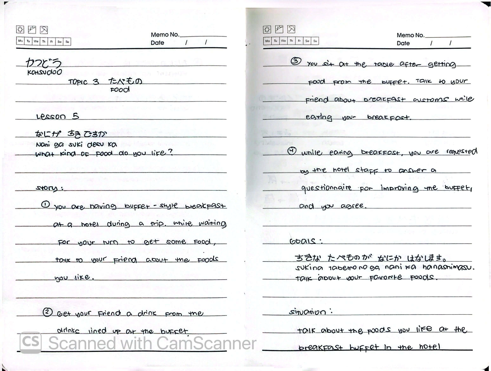
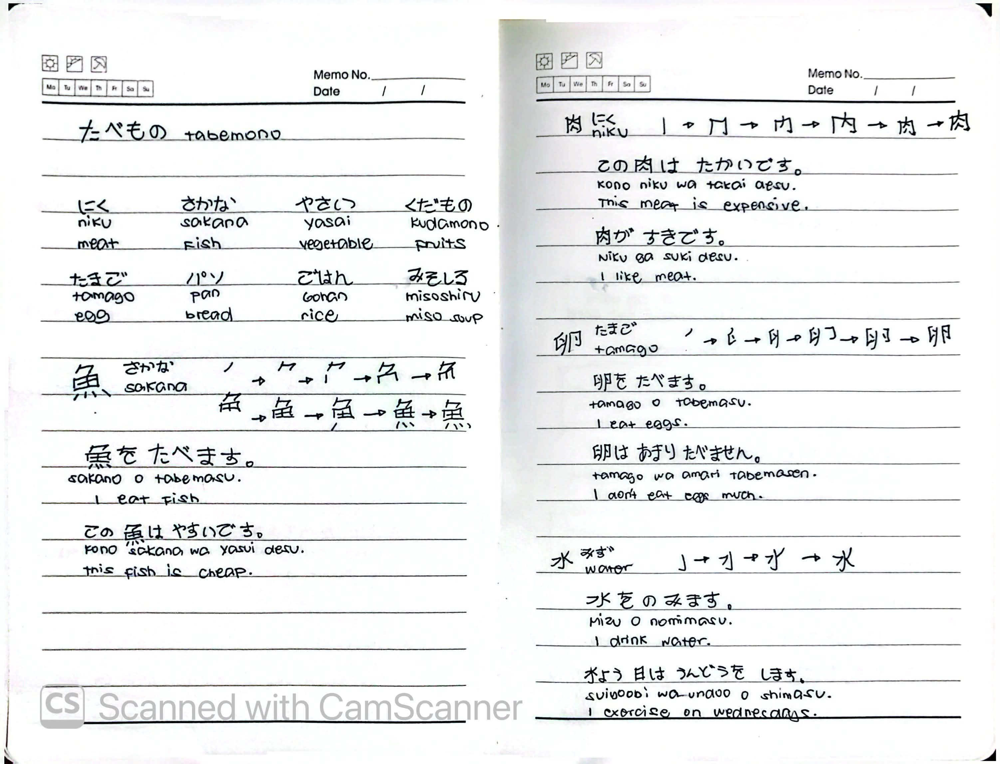
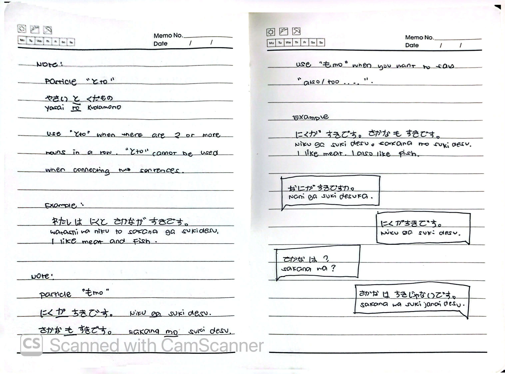

# 🎌 Lesson 5: なにが すきですか (Nani ga suki desu ka)

**Course:** Marugoto A1-1 (Katsudoo & Rikai)
**Topic:** Topic 3 — たべもの (Tabemono - Food)
**Mode:** かつどう (Katsudoo)
**Status:** 🚧 In Progress

---

## 🎯 Can-Do Objective
**Can-do 5:** Talk about your favorite foods.
**Goal:** すきな たべものが なにか はなします (Talk about your favorite foods)

---

## 📖 Story: Hotel Breakfast Buffet

**English Summary:**
You are having a buffet-style breakfast at a hotel during a trip.

1. While waiting for your turn to get some food, talk to your friend about the foods you like.
2. Get your friend a drink from the drinks lined up at the buffet.
3. You sit at the table after getting food from the buffet. Talk to your friend about breakfast customs while eating your breakfast.
4. While eating breakfast, you are requested by the hotel staff to answer a questionnaire for improving the buffet, and you agree.

**Situation:** Talk about the foods you like at the breakfast buffet in the hotel.

---

## 🍽️ Food Vocabulary

| Japanese | Romaji | English |
| :--- | :--- | :--- |
| たべもの | *tabemono* | food |
| にく | *niku* | meat |
| さかな | *sakana* | fish |
| やさい | *yasai* | vegetable |
| くだもの | *kudamono* | fruits |
| たまご | *tamago* | egg |
| パン | *pan* | bread |
| ごはん | *gohan* | rice |
| みそしる | *misoshiru* | miso soup |
| みず | *mizu* | water |

---

## ✍️ Kanji Practice

### 肉 (niku) — Meat
**Stroke order:** 冂 → 人 → 内 → 肉

- この肉は たかいです。 (*Kono niku wa takai desu.*) — This meat is expensive.
- 肉が すきです。 (*Niku ga suki desu.*) — I like meat.

### 魚 (sakana) — Fish
**Stroke order:** 勹 → 田 → 魚

- 魚を たべます。 (*Sakana o tabemasu.*) — I eat fish.
- この魚は やすいです。 (*Kono sakana wa yasui desu.*) — This fish is cheap.

### 卵 (tamago) — Egg
**Stroke order:** 卩 → 卵 → 卵

- 卵を たべます。 (*Tamago o tabemasu.*) — I eat eggs.
- 卵は あまり たべません。 (*Tamago wa amari tabemasen.*) — I don't eat eggs much.

### 水 (mizu) — Water
**Stroke order:** 亅 → 水 → 水

- 水を のみます。 (*Mizu o nomimasu.*) — I drink water.
- すいようびは うんどうを します。 (*Suiyoobi wa undoo o shimasu.*) — I exercise on Wednesdays.

---

## 🔗 Grammar: Particle と (to)

### Use
Use 「と」when there are **2 or more nouns in a row**. 
「と」**cannot** be used when connecting two sentences.

### Example
| Japanese | Romaji | English |
| :--- | :--- | :--- |
| やさいと くだもの | *yasai to kudamono* | vegetables and fruits |
| わたしは にく と さかな が すきです。 | *Watashi wa niku to sakana ga suki desu.* | I like meat and fish. |

---

## 🔑 Grammar: Particle も (mo)

### Use
Use 「も」when you want to say **"also / too"**.

### Example
| Japanese | Romaji | English |
| :--- | :--- | :--- |
| にくが すきです。さかなも すきです。 | *Niku ga suki desu. Sakana mo suki desu.* | I like meat. I also like fish. |

---

## 💬 Practice Dialogue

| Speaker | Japanese | Romaji | English |
| :--- | :--- | :--- | :--- |
| A | なにが すきですか。 | *Nani ga suki desu ka.* | What do you like? |
| B | にくが すきです。 | *Niku ga suki desu.* | I like meat. |
| A | さかなは？ | *Sakana wa?* | What about fish? |
| B | さかなは すきじゃないです。 | *Sakana wa suki ja nai desu.* | I don't like fish. |

---

## 📝 Study Log & Additional Notes

- **2026-10-06:** Started Katsudoo Lesson 5. Learned food vocabulary, kanji practice (肉, 魚, 卵, 水), and the particles と (and) and も (also/too).

---

## 📸 Handwritten Notes (Appendix)
> *Scanned pages from my physical study notebook.*

**Page 1 — Intro, Story & Goals**

**Page 2 — Food Vocabulary & Kanji Practice**

**Page 3 — Particles と and も**
