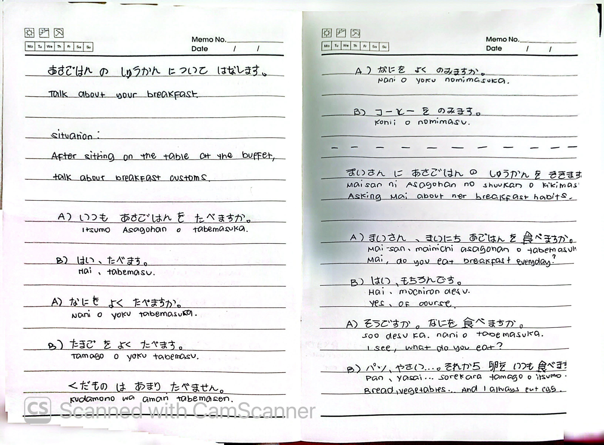
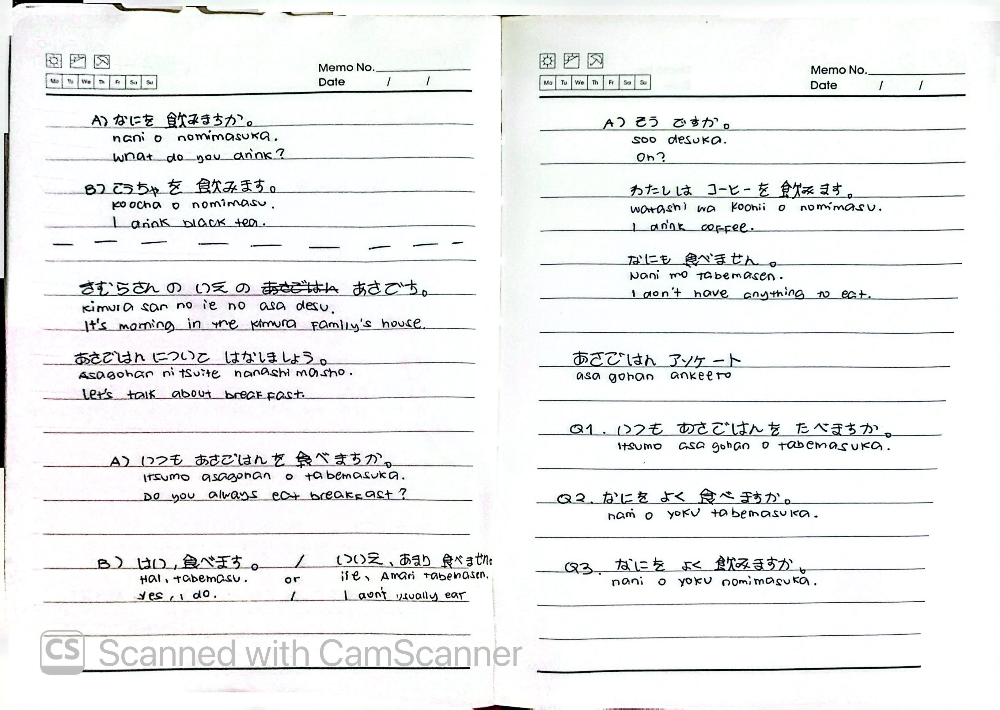

# 🎌 Lesson 5: なにが すきですか (Nani ga suki desu ka)

**Course:** Marugoto A1-1 (Katsudoo & Rikai)
**Topic:** Topic 3 — たべもの (Tabemono - Food)
**Mode:** かつどう (Katsudoo)
**Status:** ✅ Completed

---

## 🎯 Can-Do Objective
**Can-do 5:** Talk about your favorite foods and offer drinks.
**Goal:** すきな たべものが なにか はなします (Talk about your favorite foods)

---

## 📖 Story: Hotel Breakfast Buffet

**English Summary:**
You are having a buffet-style breakfast at a hotel during a trip.

1. While waiting for your turn to get some food, talk to your friend about the foods you like.
2. Get your friend a drink from the drinks lined up at the buffet.
3. You sit at the table after getting food from the buffet. Talk to your friend about breakfast customs while eating your breakfast.
4. While eating breakfast, you are requested by the hotel staff to answer a questionnaire for improving the buffet, and you agree.

**Situation:** Talk about the foods you like at the breakfast buffet in the hotel.

---

## 🍽️ Food Vocabulary

| Japanese | Romaji | English |
| :--- | :--- | :--- |
| たべもの | *tabemono* | food |
| にく | *niku* | meat |
| さかな | *sakana* | fish |
| やさい | *yasai* | vegetable |
| くだもの | *kudamono* | fruits |
| たまご | *tamago* | egg |
| パン | *pan* | bread |
| ごはん | *gohan* | rice |
| みそしる | *misoshiru* | miso soup |
| みず | *mizu* | water |
| カレー | *karee* | curry |

---

## 🥤 Drinks Vocabulary (のみもの - Nomimono)

| Japanese | Romaji | English |
| :--- | :--- | :--- |
| コーヒー | *koohi* | coffee |
| こうちゃ | *koocha* | English tea |
| ぎゅうにゅう | *gyuunyuu* | milk |
| おちゃ | *ocha* | Japanese tea |
| ジュース | *juusu* | juice |
| みず | *mizu* | water |

---

## ✍️ Kanji Practice

### 肉 (niku) — Meat
**Stroke order:** 冂 → 人 → 内 → 肉

- この肉は たかいです。 (*Kono niku wa takai desu.*) — This meat is expensive.
- 肉が すきです。 (*Niku ga suki desu.*) — I like meat.

### 魚 (sakana) — Fish
**Stroke order:** 勹 → 田 → 魚

- 魚を たべます。 (*Sakana o tabemasu.*) — I eat fish.
- この魚は やすいです。 (*Kono sakana wa yasui desu.*) — This fish is cheap.

### 卵 (tamago) — Egg
**Stroke order:** 卩 → 卵 → 卵

- 卵を たべます。 (*Tamago o tabemasu.*) — I eat eggs.
- 卵は あまり たべません。 (*Tamago wa amari tabemasen.*) — I don't eat eggs much.

### 水 (mizu) — Water
**Stroke order:** 亅 → 水 → 水

- 水を のみます。 (*Mizu o nomimasu.*) — I drink water.

### 食 (tabemasu) — Eat
- ひるごはんを 食べます。 (*Hiru gohan o tabemasu.*) — Eating lunch.
- あさごはんを 食べています。 (*Asa gohan o tabete imasu.*) — You are eating breakfast.

---

## 🔗 Grammar: Particle と (to)

### Use
Use 「と」when there are **2 or more nouns in a row**. 
「と」**cannot** be used when connecting two sentences.

### Example
| Japanese | Romaji | English |
| :--- | :--- | :--- |
| やさいと くだもの | *yasai to kudamono* | vegetables and fruits |
| わたしは にく と さかな が すきです。 | *Watashi wa niku to sakana ga suki desu.* | I like meat and fish. |

---

## 🔑 Grammar: Particle も (mo)

### Use
Use 「も」when you want to say **"also / too"**.

### Example
| Japanese | Romaji | English |
| :--- | :--- | :--- |
| にくが すきです。さかなも すきです。 | *Niku ga suki desu. Sakana mo suki desu.* | I like meat. I also like fish. |

---

## ⏰ Asking About Habits (いつも / よく / あまり)

| Adverb | Meaning | Usage |
| :--- | :--- | :--- |
| いつも | *itsumo* | always / usually |
| よく | *yoku* | often |
| あまり (+ negative) | *amari* | not much |

### Examples
| Japanese | Romaji | English |
| :--- | :--- | :--- |
| いつも あさごはんを たべますか。 | *Itsumo asagohan o tabemasu ka.* | Do you always eat breakfast? |
| はい、たべます。 | *Hai, tabemasu.* | Yes, I do. |
| いいえ、あまり たべません。 | *Iie, amari tabemasen.* | No, I don't usually eat. |
| なにを よく たべますか。 | *Nani o yoku tabemasu ka.* | What do you often eat? |
| たまごを よく たべます。 | *Tamago o yoku tabemasu.* | I often eat eggs. |
| くだものは あまり たべません。 | *Kudamono wa amari tabemasen.* | I don't eat fruits much. |

---

## 💬 Practice Dialogues

### Dialogue 1: Food Preferences (Kawasaki & Dan)
| Speaker | Japanese | Romaji | English |
| :--- | :--- | :--- | :--- |
| A) かわさき | なにが すきですか。 | *Nani ga suki desu ka.* | What do you like? |
| B) ダン | やさいが すきです。 | *Yasai ga suki desu.* | I like vegetables. |
| A) かわさき | 肉は？ | *Niku wa?* | How about meat? |
| B) ダン | 肉は すきじゃないです。あまり 食べません。 | *Niku wa suki ja nai desu. Amari tabemasen.* | I don't like meat. I don't eat it much. |
| A) かわさき | へえー。わたしは 魚が すきです。 | *Hee. Watashi wa sakana ga suki desu.* | Ohh. I like fish. |

### Dialogue 2: Offering a Drink
| Speaker | Japanese | Romaji | English |
| :--- | :--- | :--- | :--- |
| A) かわさき | コーヒー、飲みますか。 | *Koohi, nomimasu ka.* | Do you want a coffee? |
| B) まつもと | はい、おねがいします。 | *Hai, onegaishimasu.* | Yes, please. |
| A) かわさき | はい、どうぞ。 | *Hai, doozo.* | Here you are. |
| B) まつもと | すみません。 | *Sumimasen.* | Thank you. |

### Dialogue 3: Interviewing Mai About Breakfast Habits
| Speaker | Japanese | Romaji | English |
| :--- | :--- | :--- | :--- |
| A | まいさん、まいにち あさごはんを たべますか。 | *Mai-san, mainichi asagohan o tabemasu ka.* | Mai, do you eat breakfast everyday? |
| B | はい、もちろんです。 | *Hai, mochiron desu.* | Yes, of course. |
| A | そうですか。なにを たべますか。 | *Soo desu ka. Nani o tabemasu ka.* | I see. What do you eat? |
| B | パン、やさい...それから たまごを いつも たべます。 | *Pan, yasai... sorekara tamago o itsumo tabemasu.* | Bread, vegetables... and I always eat eggs. |

### Dialogue 4: Kimura Family Breakfast
| Speaker | Japanese | Romaji | English |
| :--- | :--- | :--- | :--- |
| — | きむらさんの いえの あさです。あさごはんに ついて はなしましょう。 | *Kimura-san no ie no asa desu. Asagohan ni tsuite hanashimashoo.* | It's morning in the Kimura family's house. Let's talk about breakfast. |
| A | いつも あさごはんを たべますか。 | *Itsumo asagohan o tabemasu ka.* | Do you always eat breakfast? |
| B | いいえ、あまり たべません。 | *Iie, amari tabemasen.* | No, I don't eat much. |
| A | そうですか。わたしは コーヒーを のみます。なにも たべません。 | *Soo desu ka. Watashi wa koohi o nomimasu. Nani mo tabemasen.* | Oh? I drink coffee. I don't eat anything. |

### Breakfast Questionnaire (アンケート)
| # | Japanese | Romaji | English |
| :---: | :--- | :--- | :--- |
| Q1 | いつも あさごはんを たべますか。 | *Itsumo asagohan o tabemasu ka.* | Do you always eat breakfast? |
| Q2 | なにを よく たべますか。 | *Nani o yoku tabemasu ka.* | What do you often eat? |
| Q3 | なにを よく のみますか。 | *Nani o yoku nomimasu ka.* | What do you often drink? |

---

## 📝 Study Log & Additional Notes

- **2026-10-06:** Started Katsudoo Lesson 5. Learned food vocabulary, kanji practice (肉, 魚, 卵, 水), and particles と (and) and も (also/too).
- **2026-10-07:** Continued Katsudoo Lesson 5. Learned drinks vocabulary, how to offer drinks, and food preference dialogues.
- **2026-10-08:** Completed Katsudoo Lesson 5. Learned how to ask about daily habits (いつも, よく, あまり), practiced breakfast dialogues, and completed a breakfast questionnaire.

---

## 📸 Handwritten Notes (Appendix)
> *Scanned pages from my physical study notebook.*

**Page 1 — Intro, Story & Goals**

**Page 2 — Food Vocabulary & Kanji Practice**

**Page 3 — Particles と and も**

**Page 4 — Food Preference Dialogues**

**Page 5 — Drinks Vocabulary & Offering Drinks**

**Page 6 — Cafeteria & Kimura Breakfast Dialogues**

**Page 7 — Breakfast Habits & Mai's Interview**

**Page 8 — Kimura Family Dialogue & Questionnaire**
