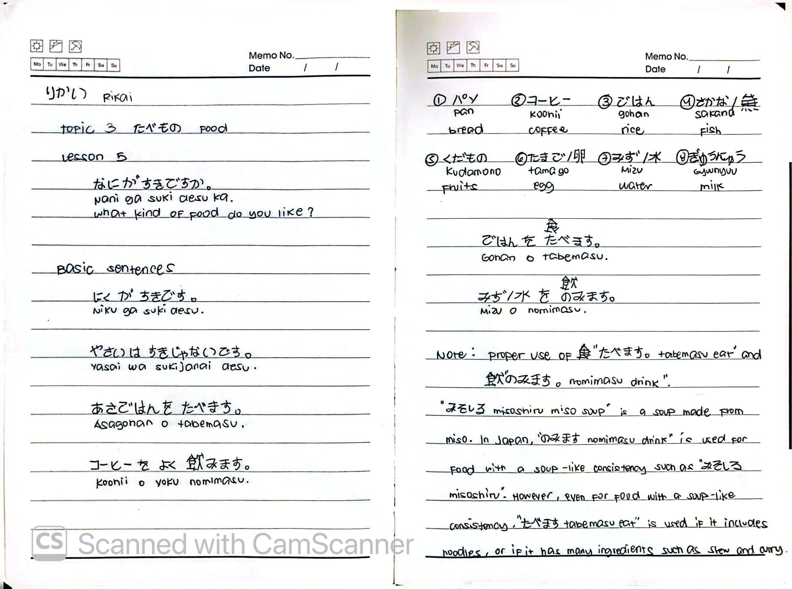
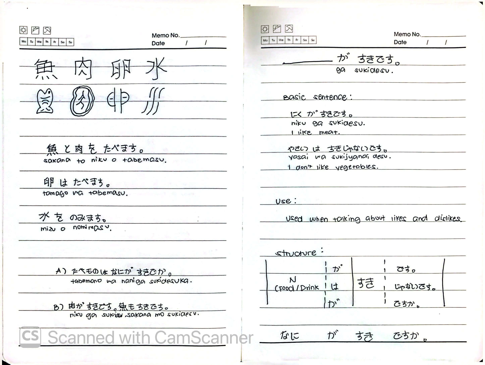
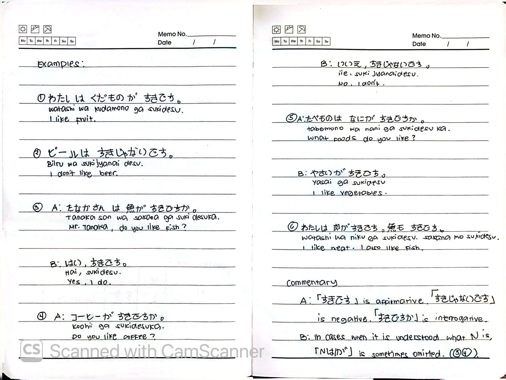

# 🎌 Rikai Lesson 5: なにが すきですか (Nani ga suki desu ka)

**Course:** Marugoto A1-1 (Katsudoo & Rikai)
**Topic:** Topic 3 — たべもの (Tabemono - Food)
**Mode:** りかい (Rikai)
**Status:** 🚧 In Progress

---

## 🎯 Can-Do Objective
**Can-do:** Talk about likes and dislikes, and understand the difference between eating and drinking.
**Goal:** すきな たべものについて はなします (Talk about your favorite foods)

---

## 🗣️ Basic Sentences

| Japanese | Romaji | English |
| :--- | :--- | :--- |
| にくが すきです。 | *Niku ga suki desu.* | I like meat. |
| やさいは すきじゃないです。 | *Yasai wa suki janai desu.* | I don't like vegetables. |
| あさごはんを たべます。 | *Asagohan o tabemasu.* | I eat breakfast. |
| コーヒーを よく のみます。 | *Koohi o yoku nomimasu.* | I often drink coffee. |

---

## 🍽️ Food & Drink Vocabulary

| Japanese | Romaji | English |
| :--- | :--- | :--- |
| パン | *pan* | bread |
| コーヒー | *koohi* | coffee |
| ごはん | *gohan* | rice |
| さかな | *sakana* | fish |
| くだもの | *kudamono* | fruits |
| たまご | *tamago* | egg |
| みず | *mizu* | water |
| ぎゅうにゅう | *gyuunyuu* | milk |
| ビール | *biiru* | beer |

---

## ✍️ Kanji Practice

### 魚 (sakana) — Fish

### 肉 (niku) — Meat

### 卵 (tamago) — Egg

### 水 (mizu) — Water

**Example Sentences:**
* 魚と 肉を たべます。 (*Sakana to niku o tabemasu.*) — I eat fish and meat.
* 卵は たべます。 (*Tamago wa tabemasu.*) — I eat eggs.
* 水を のみます。 (*Mizu o nomimasu.*) — I drink water.

---

## 🗣️ Grammar: Likes & Dislikes (すきです / すきじゃないです)

### Use
Used when talking about **likes and dislikes**.

### Structure
N (food/drink) は / が すきです。 (affirmative)
が すきじゃないです。 (negative)
が すきですか。 (interrogative)

### Basic Sentences

| Japanese | Romaji | English |
| :--- | :--- | :--- |
| にくが すきです。 | *Niku ga suki desu.* | I like meat. |
| やさいは すきじゃないです。 | *Yasai wa suki janai desu.* | I don't like vegetables. |
| なにが すきですか。 | *Nani ga suki desu ka.* | What do you like? |

---

## 🍽️ Grammar: たべます (eat) vs のみます (drink)

### Note on Proper Usage
「たべます」 (*tabemasu* — eat) and 「のみます」 (*nomimasu* — drink) are used differently depending on the food.

* **のみます (nomimasu - drink)**: Used for food with a soup-like consistency, such as 「みそしる」 (miso soup).
* **たべます (tabemasu - eat)**: Used even for food with a soup-like consistency if it includes noodles, or if it has many ingredients such as stew and curry.

**Examples:**
* ごはんを たべます。 (*Gohan o tabemasu.*) — I eat rice.
* みずを のみます。 (*Mizu o nomimasu.*) — I drink water.
* みそしるを のみます。 (*Misoshiru o nomimasu.*) — I drink miso soup.
* カレーを たべます。 (*Karee o tabemasu.*) — I eat curry.

---

## 💬 Practice Dialogues & Examples

### Dialogue 1
| Speaker | Japanese | Romaji | English |
| :--- | :--- | :--- | :--- |
| A | たべものは なにが すきですか。 | *Tabemono wa nani ga suki desu ka.* | What foods do you like? |
| B | にくが すきです。さかなも すきです。 | *Niku ga suki desu. Sakana mo suki desu.* | I like meat. I also like fish. |

### Examples

| # | Japanese | Romaji | English |
| :---: | :--- | :--- | :--- |
| ① | わたしは くだものが すきです。 | *Watashi wa kudamono ga suki desu.* | I like fruit. |
| ② | ビールは すきじゃないです。 | *Biiru wa suki janai desu.* | I don't like beer. |
| ③ | A: たなかさん は 魚が すきですか。 | *A: Tanaka-san wa sakana ga suki desu ka.* | A: Mr. Tanaka, do you like fish? |
|   | B: はい、すきです。 | *B: Hai, suki desu.* | B: Yes, I do. |
| ④ | A: コーヒーが すきですか。 | *A: Koohi ga suki desu ka.* | A: Do you like coffee? |
|   | B: いいえ、すきじゃないです。 | *B: Iie, suki janai desu.* | B: No, I don't. |
| ⑤ | A: たべものは なにが すきですか。 | *A: Tabemono wa nani ga suki desu ka.* | A: What foods do you like? |
|   | B: やさいが すきです。 | *B: Yasai ga suki desu.* | B: I like vegetables. |
| ⑥ | わたしは 肉が すきです。魚も すきです。 | *Watashi wa niku ga suki desu. Sakana mo suki desu.* | I like meat. I also like fish. |

---

## 📝 Commentary & Key Notes

**A.** 「すきです」is **affirmative**, 「すきじゃないです」is **negative**, and 「すきですか」is **interrogative**.

**B.** In cases when it is understood what N is, 「N は/が」is **sometimes omitted**. (See examples ③④.)

---

## 📝 Study Log & Additional Notes

- **2026-10-09:** Started Rikai Lesson 5. Learned how to express likes and dislikes (すきです / すきじゃないです), the difference between たべます (eat) and のみます (drink), and practiced food preference dialogues.

---

## 📸 Handwritten Notes (Appendix)
> *Scanned pages from my physical study notebook.*

**Page 1 — Intro, Basic Sentences & Vocabulary**

**Page 2 — Kanji Practice & すきです Structure**

**Page 3 — Examples & Commentary**
